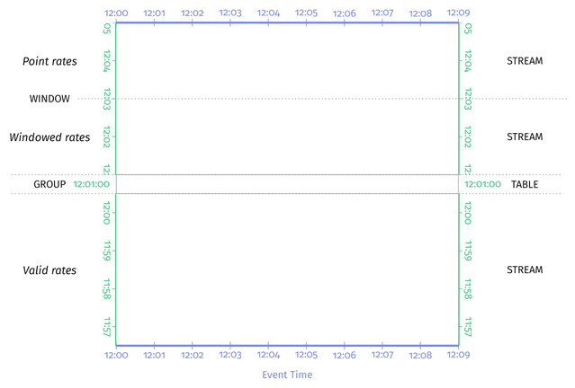
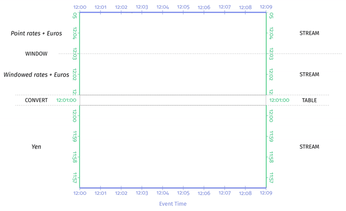
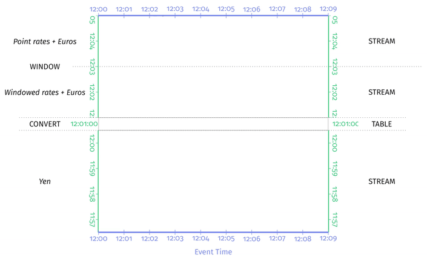

# Chapter 9. Streaming Joins

## 所有连接属于流 All Your Joins Are Belong to Streaming

**连接本身就是一种分组操作grouping**，将两个表中有共同属性的数据连接起来，而[分组操作总是输入流数据并产生表数据](https://github.com/JasonYuchen/notes/blob/master/streamingsystems/06.Streams_And_Tables.md#what-transformations)，因此**经典SQL join就是streaming SQL join**

**ANSI SQL定义了`FULL OUTER, LEFT OUTER, RIGHT OUTER, INNER, CROSS`五种连接类型**，`CROSS`作为笛卡尔积并不需要连接的数据有共享的属性因此这里暂不深入讨论，前四种类型再加上**较少见的`ANTI, SEMI`连接**本质上都是`FULL OUTER`连接但是不同的连接选择性删除掉一部分数据，为了对比各连接效果均采用`FULL OUTER`的数据但是采用`-`标记不应该出现的部分

在下列所有展示SQL数据的文本中，采用`=>`或`<=`分别代表有效的行，采用`-`填充表格来标记不应该存在的属性（为了对比不直接删去这些属性），采用`<=>`来表示有差异的结果，采用`*`强调某个结果

## 非窗口连接 Unwindowed Joins

joins（无论是否是窗口连接，**非窗口连接也可以认为是只有一个包含所有时间的全局窗口**）只是grouping操作的一种因此会产生表数据，从而当**需要以流的方式消费joins的结果时，就需要追加ungrouping操作**例如triggers

采用以下两个表的数据集来分析各种连接类型：

```text
       Left                  Right
--------------------  --------------------
| Num | Id | Time  |  | Num | Id | Time  |
--------------------  --------------------
| 1   | L1 | 12:02 |  | 2   | R2 | 12:01 |
| 2   | L2 | 12:06 |  | 3   | R3 | 12:04 |
| 3   | L3 | 12:03 |  | 4   | R4 | 12:05 |
--------------------  --------------------
```

### 全外连接 `FULL OUTER`

全外连接的结果就是参与连接的两个表的全部数据，若在指定的key上没有匹配的，则保留`null`

- **以`TABLE`为形式**的全外连接如下，其展示了最终结果：

  ```SQL
  SELECT TABLE
      Left.Id as L,
      Right.Id as R,
    FROM Left FULL OUTER JOIN Right
      ON L.Num = R.Num;
  ```

  ```text
  ---------------
  | L    | R    |
  ---------------
  | L1   | null |
  | L2   | R2   |
  | L3   | R3   |
  | null | R4   |
  ---------------
  ```

- **以`TVR`为形式**的全外连接如下，需要根据两个表的`Time`字段逐个构建连接结果，其展示了随着时间的进展连接结果的变化：

  ```SQL
  SELECT TVR
      Left.Id as L,
      Right.Id as R,
    FROM Left FULL OUTER JOIN Right
      ON L.Num = R.Num;
  ```

  ```text
  -------------------------------------------------------------------------
  |  [-inf, 12:01)  |  [12:01, 12:02) |  [12:02, 12:03) |  [12:03, 12:04) |
  | --------------- | --------------- | --------------- | --------------- |
  | | L    | R    | | | L    | R    | | | L    | R    | | | L    | R    | |
  | --------------- | --------------- | --------------- | --------------- |
  | --------------- |*| null | R2   | | | L1   | null | | | L1   | null | |
  |                 | --------------- |*| null | R2   | | | null | R2   | |
  |                 |                 | --------------- |*| L3   | null | |
  |                 |                 |                 | --------------- |
  -------------------------------------------------------------------------
  | [12:04, 12:05)  |  [12:05, 12:06) |  [12:06, 12:07) |
  | --------------- | --------------- | --------------- |
  | | L    | R    | | | L    | R    | | | L    | R    | |
  | --------------- | --------------- | --------------- |
  | | L1   | null | | | L1   | null | | | L1   | null | |
  | | null | L2   | | | null | L2   | |*| L2   | L2   | |
  |*| L3   | L3   | | | L3   | L3   | | | L3   | L3   | |
  | --------------- |*| null | L4   | | | null | L4   | |
  |                 | --------------- | --------------- |
  -------------------------------------------------------
  ```

- **以`STREAM`为形式**的全外连接如下，当后续发现有连接的数据时，需要对此前的结果撤回，即`undo`，`STREAM`形式展示的结果就是捕获了`TVR`形式中**连续两次结果的变化量delta**：

  ```SQL
  SELECT STREAM
      Left.Id as L,
      Right.Id as R,
      CURRENT_TIMESTAMP as Time,
      Sys.Undo as Undo
    FROM Left FULL OUTER JOIN Right
      ON L.Num = R.Num;
  ```

  ```text
  ------------------------------
  | L    | R    | Time  | Undo |
  ------------------------------
  | null | R2   | 12:01 |      |
  | L1   | null | 12:02 |      |
  | L3   | null | 12:03 |      |
  | L3   | null | 12:04 | undo |
  | L3   | R3   | 12:04 |      |
  | null | R4   | 12:05 |      |
  | null | R2   | 12:06 | undo |
  | L2   | R2   | 12:06 |      |
  ....... [12:00, 12:10] .......
  ```

从上述结果可以看出，**无论是`TABLE`、`TVR`还是`STREAM`都是展示了相同的结果**，只是侧重不同，而所有其他连接的结果都只是在全外连接上加上了相应的结果过滤filter

### 左外连接 `LEFT OUTER`

左外连接的结果就是参与连接的左表的全部数据，若在指定的key上没有匹配的，则右表的位置保留`null`，其`TABLE`和`STREAM`形式的结果如下：

```SQL
SELECT TABLE
    Left.Id as L,
    Right.Id as R
  FROM Left LEFT OUTER JOIN Right
    ON L.Num = R.Num;

SELECT STREAM
    Left.Id as L,
    Right.Id as R,
    Sys.EmitTime as Time,
    Sys.Undo as Undo
  FROM Left LEFT OUTER JOIN Right
    ON L.Num = R.Num;
```

```text
       TABLE                   STREAM
  ---------------   ------------------------------
  | L    | R    |   | L    | R    | Time  | Undo |
  ---------------   ------------------------------
=>| L1   | null |   |-null-|-R2---|-12:01-|------|
=>| L2   | R2   |   | L1   | null | 12:02 |      |<=
=>| L3   | R3   |   | L3   | null | 12:03 |      |<=
  |-null-|-R4---|   | L3   | null | 12:04 | undo |<=
  ---------------   | L3   | R3   | 12:04 |      |<=
                    |-null-|-R4---|-12:05-|------|
                    |-null-|-R2---|-12:06-|-undo-|
                    | L2   | R2   | 12:06 |      |<=
                    ....... [12:00, 12:10] .......
```

### 右外连接 `RIGHT OUTER`

右外连接的结果就是参与连接的右表的全部数据，若在指定的key上没有匹配的，则左表的位置保留`null`，其`TABLE`和`STREAM`形式的结果如下：

```SQL
SELECT TABLE
    Left.Id as L,
    Right.Id as R
  FROM Left RIGHT OUTER JOIN Right
    ON L.Num = R.Num;

SELECT STREAM
    Left.Id as L,
    Right.Id as R,
    Sys.EmitTime as Time,
    Sys.Undo as Undo
  FROM Left RIGHT OUTER JOIN Right
    ON L.Num = R.Num;
```

```text
       TABLE                   STREAM
  ---------------   ------------------------------
  | L    | R    |   | L    | R    | Time  | Undo |
  ---------------   ------------------------------
  |-L1---|-null-|   | null | R2   | 12:01 |      |<=
=>| L2   | R2   |   |-L1---|-null-|-12:02-|------|
=>| L3   | R3   |   |-L3---|-null-|-12:03-|------|
=>| null | R4   |   |-L3---|-null-|-12:04-|-undo-|
  ---------------   | L3   | R3   | 12:04 |      |<=
                    | null | R4   | 12:05 |      |<=
                    | null | R2   | 12:06 | undo |<=
                    | L2   | R2   | 12:06 |      |<=
                    ....... [12:00, 12:10] .......
```

### 内连接 `INNER`

内连接的结果就是所有得到匹配的数据（即左外连接的结果与右外连接的结果的交集），若在指定的key上没有匹配的，则不会出现在结果中，其`TABLE`和`STREAM`形式的结果如下：

```SQL
SELECT TABLE
    Left.Id as L,
    Right.Id as R
  FROM Left INNER JOIN Right
    ON L.Num = R.Num;

SELECT STREAM
    Left.Id as L,
    Right.Id as R,
    Sys.EmitTime as Time,
    Sys.Undo as Undo
  FROM Left INNER JOIN Right
    ON L.Num = R.Num;
```

```text
       TABLE                   STREAM
  ---------------   ------------------------------
  | L    | R    |   | L    | R    | Time  | Undo |
  ---------------   ------------------------------
  |-L1---|-null-|   |-null-|-R2---|-12:01-|------|
=>| L2   | R2   |   |-L1---|-null-|-12:02-|------|
=>| L3   | R3   |   |-L3---|-null-|-12:03-|------|
  |-null-|-R4---|   |-L3---|-null-|-12:04-|-undo-|
  ---------------   | L3   | R3   | 12:04 |      |<=
                    |-null-|-R4---|-12:05-|------|
                    |-null-|-R2---|-12:06-|-undo-|
                    | L2   | R2   | 12:06 |      |<=
                    ....... [12:00, 12:10] .......
```

需要注意的是，内连接从结果过滤之后来看似乎不可能出现`undo`，实际上假如**某时刻连接有数据（从而有结果），而在下一时刻数据发生了改变**，此时就必须`undo`旧数据的连接结果并给出新数据，例如：

```text
       TABLE                   STREAM
  ---------------   ------------------------------
  | L    | R    |   | L    | R    | Time  | Undo |
  ---------------   ------------------------------
  | L2   | R2   |   | L3   | R3   | 12:04 |      |
  | L3v2 | R3   |   | L2   | R2   | 12:06 |      |
  ---------------  *| L3   | R3   | 12:07 | undo |
                   *| L3v2 | R3   | 12:07 |      |
                    ....... [12:00, 12:10] .......
```

### 反连接 `ANTI`

反连接的结果就是全外连接的结果去除内连接的结果（内连接的结果求反），反连接包含了所有未能找到匹配的结果，其`TABLE`和`STREAM`形式的结果（通常情况下内连接的结果数较少，而反连接就是结果数较多）如下：

```SQL
SELECT TABLE
    Left.Id as L,
    Right.Id as R
  FROM Left ANTI JOIN Right
    ON L.Num = R.Num;

SELECT STREAM
    Left.Id as L,
    Right.Id as R,
    Sys.EmitTime as Time,
    Sys.Undo as Undo
  FROM Left ANTI JOIN Right
    ON L.Num = R.Num;
```

```text
       TABLE                   STREAM
  ---------------   ------------------------------
  | L    | R    |   | L    | R    | Time  | Undo |
  ---------------   ------------------------------
=>| L1   | null |   | null | R2   | 12:01 |      |<=
  |-L2---|-R2---|   | L1   | null | 12:02 |      |<=
  |-L3---|-R3---|   | L3   | null | 12:03 |      |<=
=>| null | R4   |   | L3   | null | 12:04 | undo |<=
  ---------------   |-L3---|-R3---|-12:04-|------|
                    | null | R4   | 12:05 |      |<=
                    | null | R2   | 12:06 | undo |<=
                    |-L2---|-R2---|-12:06-|------|
                    ....... [12:00, 12:10] .......
```

### 半连接 `SEMI`

半连接相对少见，采用以下数据集来展示，且总是**保留左表而丢弃右表**，数据中不同的`N_M`代表着左表和右表能够匹配的记录比例，例如`1:0`代表左表一条记录没有匹配的右表记录

**半连接的结果类似于内连接的结果，但会抛弃掉右表的所有数据，同时假如同一条左表数据能够匹配并生成多条结果，也只会保留一条而不是重复**，例如下面结果中被`<=>`标记的行

```text
       LeftNM                 RightNM
---------------------   ---------------------
| N_M | Id  | Time  |   | N_M | Id  | Time  |
---------------------   ---------------------
| 1:0 | L2  | 12:07 |   | 0:1 | R1  | 12:02 |
| 1:1 | L3  | 12:01 |   | 1:1 | R3  | 12:14 |
| 1:2 | L4  | 12:05 |   | 1:2 | R4A | 12:03 |
| 2:1 | L5A | 12:09 |   | 1:2 | R4B | 12:04 |
| 2:1 | L5B | 12:08 |   | 2:1 | R5  | 12:06 |
| 2:2 | L6A | 12:12 |   | 2:2 | R6A | 12:11 |
| 2:2 | L6B | 12:10 |   | 2:2 | R6B | 12:13 |
---------------------   ---------------------
```

- **内连接与半连接的`TABLE`形式**对比如下：

  ```SQL
  /* COALESCE(...)的参数是一系列表达式，从左到右求值返回第一个结果非null的表达式结果 */
  SELECT TABLE
      COALESCE(LeftMN.N_M, RightNM.N_M) as N_M,
      LeftNM.Id as L
    FROM LeftNM INNER JOIN RightNM
      ON LeftNM.N_M = RightNM.N_M;

  SELECT TABLE
      COALESCE(LeftNM.N_M, RightNM.N_M) as N_M,
      LeftNM.Id as L
    FROM LeftNM SEMI JOIN RightNM ON
      LeftNM.N_M = RightNM.N_M;
  ```

  ```text
        INNER JOIN              SEMI JOIN
    ---------------------   ---------------------
    | N_M | L    |-R----|   | N_M | L    |-R----|
    ---------------------   ---------------------
    |-0:1-|-null-|-R1---|   |-0:1-|-null-|-R1---|
    |-1:0-|-L2---|-null-|   |-1:0-|-L2---|-null-|
  =>| 1:1 | L3   |-R3---|   | 1:1 | L3   |-R3---|<=
  =>| 1:2 | L4   |-R4A--|   | 1:2 | L4   |-R4A--|<=
  =>| 1:2 | L4   |-R4B--|<=>|-1:2-|-L4---|-R4B--|
  =>| 2:1 | L5A  |-R5---|   | 2:1 | L5A  |-R5---|<=
  =>| 2:1 | L5B  |-R5---|   | 2:1 | L5B  |-R5---|<=
  =>| 2:2 | L6A  |-R6A--|   | 2:2 | L6A  |-R6A--|<=
  =>| 2:2 | L6A  |-R6B--|<=>|-2:2-|-L6A--|-R6B--|
  =>| 2:2 | L6B  |-R6A--|   | 2:2 | L6B  |-R6A--|<=
  =>| 2:2 | L6B  |-R6B--|<=>|-2:2-|-L6B--|-R6B--|
    ---------------------   ---------------------
  ```

- **内连接与半连接的`STREAM`形式**对比如下，`STREAM`形式就可以明显看出在左表数据有多个匹配时只保留了一个：

  ```SQL
  SELECT STREAM
      COALESCE(LeftMN.N_M, RightNM.N_M) as N_M,
      LeftNM.Id as L
      Sys.EmitTime as Time,
      Sys.Undo as Undo
    FROM LeftNM INNER JOIN RightNM
      ON LeftNM.N_M = RightNM.N_M;

  SELECT STREAM
      COALESCE(LeftNM.N_M, RightNM.N_M) as N_M,
      LeftNM.Id as L
      Sys.EmitTime as Time,
      Sys.Undo as Undo
    FROM LeftNM SEMI JOIN RightNM
      ON LeftNM.N_M = RightNM.N_M;
  ```

  ```text
                INNER JOIN                              SEMI JOIN
    ------------------------------------   ------------------------------------
    | N_M | L    |-R----| Time  | Undo |   | N_M | L    |-R----| Time  | Undo |
    ------------------------------------   ------------------------------------
    |-1:1-|-L3---|-null-|-12:01-|------|   |-1:1-|-L3---|-null-|-12:01-|------|
    |-0:1-|-null-|-R1---|-12:02-|------|   |-0:1-|-null-|-R1---|-12:02-|------|
    |-1:2-|-null-|-R4A--|-12:03-|------|   |-1:2-|-null-|-R4A--|-12:03-|------| 
    |-1:2-|-null-|-R4B--|-12:04-|------|   |-1:2-|-null-|-R4B--|-12:04-|------| 
    |-1:2-|-null-|-R4A--|-12:05-|-undo-|   |-1:2-|-null-|-R4A--|-12:05-|-undo-| 
    |-1:2-|-null-|-R4B--|-12:05-|-undo-|   |-1:2-|-null-|-R4B--|-12:05-|-undo-| 
  =>| 1:2 | L4   |-R4A--| 12:05 |      |   | 1:2 | L4   |-R4A--| 12:05 |      |<= 
  =>| 1:2 | L4   |-R4B--| 12:05 |      |<=>|-1:2 |-L4---|-R4B--|-12:05-|------| 
    |-2:1-|-null-|-R5---|-12:06-|------|   |-2:1-|-null-|-R5---|-12:06-|------| 
    |-1:0-|-L2---|-null-|-12:07-|------|   |-1:0-|-L2---|-null-|-12:07-|------| 
    |-2:1-|-null-|-R5---|-12:08-|-undo-|   |-2:1-|-null-|-R5---|-12:08-|-undo-| 
  =>| 2:1 | L5B  |-R5---| 12:08 |      |   | 2:1 | L5B  |-R5---| 12:08 |      |<= 
  =>| 2:1 | L5A  |-R5---| 12:09 |      |   | 2:1 | L5A  |-R5---| 12:09 |      |<= 
    |-2:2-|-L6B--|-null-|-12:10-|------|   |-2:2-|-L6B--|-null-|-12:10-|------| 
    |-2:2-|-L6B--|-null-|-12:10-|-undo-|   |-2:2-|-L6B--|-null-|-12:10-|-undo-| 
  =>| 2:2 | L6B  |-R6A--| 12:11 |      |   | 2:2 | L6B  |-R6A--| 12:11 |      |<= 
  =>| 2:2 | L6A  |-R6A--| 12:12 |      |   | 2:2 | L6A  |-R6A--| 12:12 |      |<= 
  =>| 2:2 | L6A  |-R6B--| 12:13 |      |<=>|-2:2-|-L6A--|-R6B--|-12:13-|------| 
  =>| 2:2 | L6B  |-R6B--| 12:13 |      |<=>|-2:2-|-L6B--|-R6B--|-12:13-|------| 
    |-1:1-|-L3---|-null-|-12:14-|-undo-|   |-1:1-|-L3---|-null-|-12:14-|-undo-| 
  =>| 1:1 | L3   |-R3---| 12:14 |      |   | 1:1 | L3   |-R3---| 12:14 |      |<= 
    .......... [12:00, 12:15] ..........   .......... [12:00, 12:15] ..........
  ```

## 窗口连接 Windowed Joins

**窗口连接并不是streaming join的必须选项**，从非窗口连接可以看出所有join本质上都属于streaming join，而窗口连接只是在诸多场合非常有用，其主要动力有以下两点：

- **将时间分区 To partition time in some meaningful way**
  最典型的场合例如固定窗口按每天分区，从而每天的交易数据可以和用户join产生账单
- **提供有意义的连接完成参考时间点 To provide a meaningful reference point for timing out a join**
  对于无限数据量的join，采用窗口的方式并且利用水印代表窗口数据以完整的含义，可以在水印抵达时结束join的计算
  
  **将水印作为参考时间点，此时认为窗口数据已完整，join已完成，那么可以安全的结束（timed out）任何未join的数据并输出其部分结果**（outer joins会有包含`null`的部分结果）

继续采用以下两个表的数据集来分析各种窗口连接：

```text
       Left                  Right
--------------------  --------------------
| Num | Id | Time  |  | Num | Id | Time  |
--------------------  --------------------
| 1   | L1 | 12:02 |  | 2   | R2 | 12:01 |
| 2   | L2 | 12:06 |  | 3   | R3 | 12:04 |
| 3   | L3 | 12:03 |  | 4   | R4 | 12:05 |
--------------------  --------------------
```

获取这两个表每个数据所在的窗口的参考方式如下：

```SQL
SELECT TABLE
    *,
    TUMBLE(Time, INTERVAL '5' MINUTE) as Window
  FROM Left

SELECT TABLE
    *,
    TUMBLE(Time, INTERVAL '5' MINUTE) as Window
  FROM Right
```

```text
               Left                                    Right
-------------------------------------   -------------------------------------
| Num | Id | Time  | Window         |   | Num | Id | Time  | Window         |
-------------------------------------   -------------------------------------
| 1   | L1 | 12:02 | [12:00, 12:05) |   | 2   | R2 | 12:01 | [12:00, 12:05) |
| 2   | L2 | 12:06 | [12:05, 12:10) |   | 3   | R3 | 12:04 | [12:00, 12:05) |
| 3   | L3 | 12:03 | [12:00, 12:05) |   | 4   | R4 | 12:05 | [12:05, 12:06) |
-------------------------------------   -------------------------------------
```

### 固定窗口 Fixed Windows

**固定窗口连接只是在join上添加了时间维度**这一条件，即在原来只需要`L.Num = R.Num`的基础上还要求`L.Window = R.Window`：

```SQL
SELECT TABLE
    Left.Id as L,
    Right.Id as R
  FROM Left FULL OUTER JOIN Right
    ON L.Num = R.Num;

SELECT TABLE
    Left.Id as L,
    Right.Id as R,
    COALESCE(TUMBLE(Left.Time, INTERVAL '5' MINUTE),
             TUMBLE(Right.Time, INTERVAL '5' MINUTE)) as Window
  FROM Left FULL OUTER JOIN Right
    ON L.Num = R.Num
      AND TUMBLE(Left.Time, INTERVAL '5' MINUTE)
        = TUMBLE(Right.Time, INTERVAL '5' MINUTE);
```

```text
  ---------------   --------------------------------
  | L    | R    |   | L    | R    | Window         |
  ---------------   --------------------------------
  | L1   | null |   | L1   | null | [12:00, 12:05) |
 *| L2   | R2   |  *| null | R2   | [12:00, 12:05) |
  | L3   | R3   |   | L3   | R3   | [12:00, 12:05) |
  | null | R4   |  *| L2   | null | [12:05, 12:10) |
  ---------------   | null | R4   | [12:05, 12:10) |
                    --------------------------------
```

从上述`TABLE`形式的连接结果可以看出，窗口连接下，处于不同窗口的`L2`和`R2`无法匹配，此时就会产生两条不匹配的含`null`结果，而这个不匹配的过程采用下述`STREAM`的形式能够更清晰的观察：

- 非窗口连接下首先发现`R2`不能匹配并输出一条结果，后续发现能够匹配时就撤回`undo`并输出匹配的结果
- 窗口连接下`R2`始终未能匹配因此不会撤回`undo`，而`L2`没有能够匹配的数据，就会输出未匹配结果

```SQL
SELECT STREAM
    Left.Id as L,
    Right.Id as R,
    Sys.EmitTime as Time,
    Sys.Undo as Undo
  FROM Left FULL OUTER JOIN Right
    ON L.Num = R.Num;

SELECT STREAM
    Left.Id as L,
    Right.Id as R,
    Sys.EmitTime as Time,
    Sys.Undo as Undo,
    COALESCE(TUMBLE(Left.Time, INTERVAL '5' MINUTE),
             TUMBLE(Right.Time, INTERVAL '5' MINUTE)) as Window
  FROM Left FULL OUTER JOIN Right
    ON L.Num = R.Num
      AND TUMBLE(Left.Time, INTERVAL '5' MINUTE)
        = TUMBLE(Right.Time, INTERVAL '5' MINUTE);
```

```text
  ------------------------------   -----------------------------------------------
  | L    | R    | Time  | Undo |   | L    | R    | Time  | Window         | Undo |
  ------------------------------   -----------------------------------------------
  | null | R2   | 12:01 |      |   | null | R2   | 12:01 | [12:00, 12:05) |      |
  | L1   | null | 12:02 |      |   | L1   | null | 12:02 | [12:00, 12:05) |      |
  | L3   | null | 12:03 |      |   | L3   | null | 12:03 | [12:00, 12:05) |      |
  | L3   | null | 12:04 | undo |   | L3   | null | 12:04 | [12:00, 12:05) | undo |
  | L3   | R3   | 12:04 |      |   | L3   | R3   | 12:04 | [12:00, 12:05) |      |
  | null | R4   | 12:05 |      |   | null | R4   | 12:05 | [12:05, 12:10) |      |
 *| null | R2   | 12:06 | undo |  *| L2   | null | 12:06 | [12:05, 12:10) |      |
 *| L2   | R2   | 12:06 |      |   ............... [12:00, 12:10].................
  ....... [12:00, 12:10] .......
```

除了`FULL OUTER`以外，`LEFT OUTER, RIGHT OUTER, INNER, ANTI, SEMI`的固定窗口连接形式都是如此，这里略去其他示例，只展示`LEFT OUTER`的`TABLE`形式结果：

```SQL
SELECT TABLE
    Left.Id as L,
    Right.Id as R,
    Sys.EmitTime as Time,
    Sys.Undo as Undo
  FROM Left LEFT OUTER JOIN Right
    ON L.Num = R.Num;

SELECT TABLE
    Left.Id as L,
    Right.Id as R,
    Sys.EmitTime as Time,
    Sys.Undo as Undo,
    COALESCE(TUMBLE(Left.Time, INTERVAL '5' MINUTE),
             TUMBLE(Right.Time, INTERVAL '5' MINUTE)) as Window
  FROM Left LEFT OUTER JOIN Right
    ON L.Num = R.Num
      AND TUMBLE(Left.Time, INTERVAL '5' MINUTE)
        = TUMBLE(Right.Time, INTERVAL '5' MINUTE);
```

```text
  ---------------   --------------------------------
  | L    | R    |   | L    | R    | Window         |
  ---------------   --------------------------------
  | L1   | null |   | L1   | null | [12:00, 12:05) |
 *| L2   | R2   |  *| L2   | null | [12:05, 12:10) |
  | L3   | R3   |   | L3   | R3   | [12:00, 12:05) |
  ---------------   --------------------------------
```

### 时效 Temporal Validity

#### 时效窗口 Temporal Validity Windows

时间有效性窗口主要应用在当**数据行代表的是一段时间内有效的数据**这种场合，具体来说示例如下：

> Temporal validity windows apply in situations in which the rows in a relation
effectively slice time into regions wherein a given value is valid.

表中是各个货币与Yen的兑换比例，关注其中的Euro-Yen的兑换比例有三条记录，则意味着在`[-inf, 12:00)`这段时间内的兑换比例未定义，在`[12:00, 12:03)`这段时间内比例为114，以此类推，**数据行实际上分割了时间**

```text
              YenRates
--------------------------------------
| Curr | Rate | EventTime | ProcTime |
--------------------------------------
| USD  | 102  | 12:00:00  | 12:04:13 |
| Euro | 114  | 12:00:30  | 12:06:23 |
| Yen  | 1    | 12:01:00  | 12:05:18 |
| Euro | 116  | 12:03:00  | 12:09:07 |
| Euro | 119  | 12:06:00  | 12:07:33 |
--------------------------------------

For Euro-Yen:
      Undefined             114 ¥/€                116 ¥/€                119 ¥/€
|----[-inf, 12:00)----|----[12:00, 12:03)----|----[12:03, 12:06)----|----[12:06, now)----→
```

**这种时效的作用导致每一条数据的作用时间会随着后续数据的抵达而改变，尤其是数据乱序抵达时**，例如按照`ProcTime`顺序首先抵达的是Rate=114，则其有效时间是`[12:00, +inf)`，而当后续Rate=119抵达时，Rate=114的有效时间变为`[12:00, 12:06)`，完整如下图：

```text
Range of processing time | Event-time validity timeline during that range of processing-time
=========================|============================================================================
                         |
                         |      Undefined
        [-inf, 12:06:23) | |--[-inf, +inf)-----------------------------------------------------------→
                         |
                         |      Undefined        114 ¥/€
    [12:06:23, 12:07:33) | |--[-inf, 12:00)--|--[12:00, +inf)----------------------------------------→
                         |
                         |      Undefined        114 ¥/€                               119 ¥/€
    [12:07:33, 12:09:07) | |--[-inf, 12:00)--|--[12:00, 12:06)---------------------|--[12:06, +inf)--→
                         |
                         |      Undefined        114 ¥/€            116 ¥/€            119 ¥/€
         [12:09:07, now) | |--[-inf, 12:00)--|--[12:00, 12:03)--|--[12:03, 12:06)--|--[12:06, +inf)--→
```

从`TVR`的角度来看，**每当一条新数据抵达时就几乎需要修改所有已有数据的有效时间**，这就导致了巨大的性能开销以及潜在的事务问题（正在修改某个数据的有效时间而该数据正在被使用），与此前提到的[窗口合并merge](https://github.com/JasonYuchen/notes/blob/master/streamingsystems/06.Streams_And_Tables.md#where-windowing)正好相反，这里涉及到的是**窗口收缩shrink**：

```SQL
SELECT TVR * FROM YenRatesWithRegion ORDER BY EventTime;
```

```text
---------------------------------------------------------------------------------------------
| [-inf, 12:06:23)                            | [12:06:23,12:07:33)                         |
| ------------------------------------------- | ------------------------------------------- |
| | Curr | Rate | Region         | ProcTime | | | Curr | Rate | Region         | ProcTime | |
| ------------------------------------------- | ------------------------------------------- |
| ------------------------------------------- |*| Euro | 114  | [12:00, +inf)  | 12:06:23 | |
|                                             | ------------------------------------------- |
---------------------------------------------------------------------------------------------
| [12:07:33, 12:09:07)                        | [12:09:07,+inf)                             |
| ------------------------------------------- | ------------------------------------------- |
| | Curr | Rate | Region         | ProcTime | | | Curr | Rate | Region         | ProcTime | |
| ------------------------------------------- | ------------------------------------------- |
|*| Euro | 114  | [12:00, 12:06) | 12:06:23 | |*| Euro | 114  | [12:00, 12:03) | 12:06:23 | |
|*| Euro | 119  | [12:06, +inf)  | 12:07:33 | |*| Euro | 116  | [12:03, 12:06) | 12:09:07 | |
| ------------------------------------------- | | Euro | 119  | [12:06, +inf)  | 12:07:33 | |
|                                             | ------------------------------------------- |
---------------------------------------------------------------------------------------------
```



从`TABLE`和`STREAM`的形式来看这个过程（下面使用了一个函数`VALIDITY_WINDOW`来获取时效窗口，这在标准SQL中可以通过three-way self-join做到）：

```SQL
SELECT TABLE
    Curr,
    MAX(Rate) as Rate,
    VALIDITY_WINDOW(EventTime) as Window
  FROM YenRates
  GROUP BY Curr, VALIDITY_WINDOW(EventTime)
  HAVING Curr = "Euro";

SELECT STREAM
    Curr,
    MAX(Rate) as Rate,
    VALIDITY_WINDOW(EventTime) as Window,
    Sys.EmitTime as Time,
    Sys.Undo as Undo,
  FROM YenRates
  GROUP BY Curr, VALIDITY_WINDOW(EventTime)
  HAVING Curr = "Euro";

/* Three-way self-join to generate validity window */
SELECT
    r1.Curr,
    MAX(r1.Rate) AS Rate,
    r1.EventTime AS WindowStart,
    r2.EventTime AS WIndowEnd
  FROM YenRates r1
    LEFT JOIN YenRates r2
      ON r1.Curr = r2.Curr AND r1.EventTime < r2.EventTime
    LEFT JOIN YenRates r3
      ON r1.Curr = r3.Curr AND r1.EventTime < r3.EventTime AND r3.EventTime < r2.EventTime
  WHERE r3.EventTime IS NULL
  GROUP BY r1.Curr, WindowStart, WindowEnd
  HAVING r1.Curr = 'Euro';
```

```text
             TABLE                                      STREAM
--------------------------------   --------------------------------------------------
| Curr | Rate | Window         |   | Curr | Rate | Window         | Time     | Undo |
--------------------------------   --------------------------------------------------
| Euro | 114  | [12:00, 12:03) |   | Euro | 114  | [12:00, +inf)  | 12:06:23 |      |
| Euro | 116  | [12:03, 12:06) |   | Euro | 114  | [12:00, +inf)  | 12:07:33 | undo |
| Euro | 119  | [12:06, +inf)  |   | Euro | 114  | [12:00, 12:06) | 12:07:33 |      |
--------------------------------   | Euro | 119  | [12:06, +inf)  | 12:07:33 |      |
                                   | Euro | 114  | [12:00, 12:06) | 12:09:07 | undo |
                                   | Euro | 114  | [12:00, 12:03) | 12:09:07 |      |
                                   | Euro | 116  | [12:03, 12:06) | 12:09:07 |      |
                                   ................. [12:00, 12:10] .................
```

#### 时效连接 Temporal Validity Joins

假定有货币兑换订单关系YenOrders，以及此前的汇率YenRates，示例中只关注所有Euro的订单：

```text
                YenRates                                   YenOrders
  --------------------------------------   ----------------------------------------
  | Curr | Rate | EventTime | ProcTime |   | Curr | Amount | EventTime | ProcTime |
  --------------------------------------   ----------------------------------------
  | USD  | 102  | 12:00:00  | 12:04:13 |  *| Euro | 2      | 12:02:00  | 12:05:07 |
 *| Euro | 114  | 12:00:30  | 12:06:23 |   | USD  | 1      | 12:03:00  | 12:03:44 |
  | Yen  | 1    | 12:01:00  | 12:05:18 |  *| Euro | 5      | 12:05:00  | 12:08:00 |
 *| Euro | 116  | 12:03:00  | 12:09:07 |   | Yen  | 50     | 12:07:00  | 12:10:11 |
 *| Euro | 119  | 12:06:00  | 12:07:33 |  *| Euro | 3      | 12:08:00  | 12:09:33 |
  --------------------------------------   | USD  | 5      | 12:10:00  | 12:10:59 |
                                          ----------------------------------------
```

从而时效连接YenRates和YenOrders并分别以`TABLE`，`TVR`和`STREAM`的形式展示如下：

- **`TABLE`形式**：当所有数据都已经完整时可以一次性连接如下

  ```SQL
  WITH ValidRates AS
      (SELECT
          Curr,
          MAX(Rate) as Rate,
          VALIDITY_WINDOW(EventTime) as Window
        FROM YenRates
        GROUP BY Curr, VALIDITY_WINDOW(EventTime))
  SELECT TABLE
      YenOrders.Amount as "E",
      ValidRates.Rate as "Y/E",
      YenOrders.Amount * ValidRates.Rate as "Y",
      YenOrders.EventTime as Order,
      ValidRates.Window as "Rate Window"
    FROM YenOrders FULL OUTER JOIN ValidRates
      ON YenOrders.Curr = ValidRates.Curr
        AND WINDOW_START(ValidRates.Window) <= YenOrders.EventTime
        AND YenOrders.EventTime < WINDOW_END(ValidRates.Window)
    HAVING Curr = "Euro";
  ```

  ```text
          ValidRates Table
  --------------------------------
  | Curr | Rate | Window         |
  --------------------------------
  | Euro | 114  | [12:00, 12:03) |
  | Euro | 116  | [12:03, 12:06) |
  | Euro | 119  | [12:06, +inf)  |
  --------------------------------

  -------------------------------------------
  | E | Y/E | Y   | Order | Rate Window     |
  -------------------------------------------
  | 2 | 114 | 228 | 12:02 | [12:00, 12:03)  |
  | 5 | 116 | 580 | 12:05 | [12:03, 12:06)  |
  | 3 | 119 | 357 | 12:08 | [12:06, +inf)   |
  -------------------------------------------
  ```

- **`TVR`形式**：将数据逐时间窗口进行连接展示如下，由于YenOrders和YenRates均是乱序数据，这里的结果更为复杂，但是展示出了随着数据抵达，结果的**变化过程evolution**
  在`12:05:07`时刻，数量为2的订单已经抵达系统，但**此时没有汇率数据**因此只能生成一条`E=2, Y/E=null, Y=null, Order=12:02, Rate Window=null`的记录，以此类推结果逐渐收敛到`TABLE`形式的最终结果

  ```SQL
  WITH ValidRates AS
      (SELECT
          Curr,
          MAX(Rate) as Rate,
          VALIDITY_WINDOW(EventTime) as Window
        FROM YenRates
        GROUP BY Curr, VALIDITY_WINDOW(EventTime))
  SELECT TVR
      YenOrders.Amount as "E",
      ValidRates.Rate as "Y/E",
      YenOrders.Amount * ValidRates.Rate as "Y",
      YenOrders.EventTime as Order,
      ValidRates.Window as "Rate Window"
    FROM YenOrders FULL OUTER JOIN ValidRates
      ON YenOrders.Curr = ValidRates.Curr
        AND WINDOW_START(ValidRates.Window) <= YenOrders.EventTime
        AND YenOrders.EventTime < WINDOW_END(ValidRates.Window)
    HAVING Curr = "Euro";
  ```

  ```text
                 ValidRates Stream
  --------------------------------------------------
  | Curr | Rate | Window         | Time     | Undo |
  --------------------------------------------------
  | Euro | 114  | [12:00, +inf)  | 12:06:23 |      |
  | Euro | 114  | [12:00, +inf)  | 12:07:33 | undo |
  | Euro | 114  | [12:00, 12:06) | 12:07:33 |      |
  | Euro | 119  | [12:06, +inf)  | 12:07:33 |      |
  | Euro | 114  | [12:00, 12:06) | 12:09:07 | undo |
  | Euro | 114  | [12:00, 12:03) | 12:09:07 |      |
  | Euro | 116  | [12:03, 12:06) | 12:09:07 |      |
  ................. [12:00, 12:10] .................

  -------------------------------------------------------------------------------------------
  | [-inf, 12:05:07)                           | [12:05:07, 12:06:23)                       |
  | ------------------------------------------ | ------------------------------------------ |
  | | E | Y/E | Y   | Order | Rate Window    | | | E | Y/E | Y   | Order | Rate Window    | |
  | ------------------------------------------ | ------------------------------------------ |
  | ------------------------------------------ |*| 2 |     |     | 12:02 |                | |
  |                                            | ------------------------------------------ |
  -------------------------------------------------------------------------------------------
  | [12:06:23, 12:07:33)                       | [12:07:33, 12:08:00)                       |
  | ------------------------------------------ | ------------------------------------------ |
  | | E | Y/E | Y   | Order | Rate Window    | | | E | Y/E | Y   | Order | Rate Window    | |
  | ------------------------------------------ | ------------------------------------------ |
  | | 2 | 114 | 228 | 12:02 | [12:00, +inf)  | | | 2 | 114 | 228 | 12:02 | [12:00, 12:06) | |
  | ------------------------------------------ |*|   | 119 |     |       | [12:06, +inf)  | |
  |                                            | ------------------------------------------ |
  -------------------------------------------------------------------------------------------
  | [12:08:00, 12:09:07)                       | [12:09:07, 12:09:33)                       |
  | ------------------------------------------ | ------------------------------------------ |
  | | E | Y/E | Y   | Order | Rate Window    | | | E | Y/E | Y   | Order | Rate Window    | |
  | ------------------------------------------ | ------------------------------------------ |
  | | 2 | 114 | 228 | 12:02 | [12:00, 12:06) | | | 2 | 114 | 228 | 12:02 | [12:00, 12:03) | |
  |*| 5 | 114 | 570 | 12:05 | [12:03, 12:06) | |*| 5 | 116 | 580 | 12:05 | [12:03, 12:06) | |
  |*|   | 119 |     |       | [12:06, +inf)  | |*|   | 119 |     | 12:08 | [12:06, +inf)  | |
  | ------------------------------------------ | ------------------------------------------ |
  -------------------------------------------------------------------------------------------
  | [12:09:33, now)                            |
  | ------------------------------------------ |
  | | E | Y/E | Y   | Order | Rate Window    | |
  | ------------------------------------------ |
  | | 2 | 114 | 228 | 12:02 | [12:00, 12:03) | |
  | | 5 | 116 | 580 | 12:05 | [12:03, 12:06) | |
  |*| 3 | 119 | 357 | 12:08 | [12:06, +inf)  | |
  | ------------------------------------------ |
  ----------------------------------------------
  ```

- **`STREAM`形式**：采用`STREAM`形式可以输出`TVR`中所有快照的变化量如下，结合`Undo`列使得结果相对更为直观，部分数据不全的记录在完整时可以被完整的结果替代，不完整的结果或是不准确的结果被`undo`

  ```SQL
  WITH ValidRates AS
      (SELECT
          Curr,
          MAX(Rate) as Rate,
          VALIDITY_WINDOW(EventTime) as Window
        FROM YenRates
        GROUP BY Curr, VALIDITY_WINDOW(EventTime))
  SELECT STREAM
      YenOrders.Amount as "E",
      ValidRates.Rate as "Y/E",
      YenOrders.Amount * ValidRates.Rate as "Y",
      YenOrders.EventTime as Order,
      ValidRates.Window as "Rate Window",
      Sys.EmitTime as Time,
      Sys.Undo as Undo
    FROM YenOrders FULL OUTER JOIN ValidRates
      ON YenOrders.Curr = ValidRates.Curr
        AND WINDOW_START(ValidRates.Window) <= YenOrders.EventTime
        AND YenOrders.EventTime < WINDOW_END(ValidRates.Window)
    HAVING Curr = “Euro”;
  ```

  ```text
    ------------------------------------------------------------
    | E | Y/E | Y   | Order | Rate Window    | Time     | Undo |
    ------------------------------------------------------------
    | 2 |     |     | 12:02 |                | 12:05:07 |      |
    | 2 |     |     | 12:02 |                | 12:06:23 | undo |
    | 2 | 114 | 228 | 12:02 | [12:00, +inf)  | 12:06:23 |      |<=
    | 2 | 114 | 228 | 12:02 | [12:00, +inf)  | 12:07:33 | undo |
    | 2 | 114 | 228 | 12:02 | [12:00, 12:06) | 12:07:33 |      |
    |   | 119 |     |       | [12:06, +inf)  | 12:07:33 |      |
   *| 5 | 114 | 570 | 12:05 | [12:00, 12:06) | 12:08:00 |      |<=
    | 2 | 114 | 228 | 12:02 | [12:00, 12:06) | 12:09:07 | undo |
   *| 5 | 114 | 570 | 12:05 | [12:00, 12:06) | 12:09:07 | undo |<=
    | 2 | 114 | 228 | 12:02 | [12:00, 12:03) | 12:09:07 |      |
   *| 5 | 116 | 580 | 12:05 | [12:03, 12:06) | 12:09:07 |      |<=
    |   | 119 |     |       | [12:06, +inf)  | 12:09:33 | undo |
    | 3 | 119 | 357 | 12:08 | [12:06, +inf)  | 12:09:33 |      |<=
    ...................... [12:00, 12:10] ......................
  ```

- **简化的`STREAM`形式**：实际生产环境中**通常不会考虑未能连接的结果**（不需要partial结果），并且对于汇率窗口改变但是订单金额等**实际意义的列未改变的情况下**去重（不需要多条有意义字段重复的结果），**采用内连接`INNER`以及去掉`Rate Window`字段**，`STREAM`形式中被标有`<=`的结果行保留了下来

  ```SQL
  WITH ValidRates AS
      (SELECT
          Curr,
          MAX(Rate) as Rate,
          VALIDITY_WINDOW(EventTime) as Window
        FROM YenRates
        GROUP BY Curr, VALIDITY_WINDOW(EventTime))
  SELECT STREAM
      YenOrders.Amount as "E",
      ValidRates.Rate as "Y/E",
      YenOrders.Amount * ValidRates.Rate as "Y",
      YenOrders.EventTime as Order,
      /* ValidRates.Window as "Rate Window", */
      Sys.EmitTime as Time,
      Sys.Undo as Undo
    /* FROM YenOrders FULL OUTER JOIN ValidRates */
    FROM YenOrders INNER JOIN ValidRates
      ON YenOrders.Curr = ValidRates.Curr
        AND WINDOW_START(ValidRates.Window) <= YenOrders.EventTime
        AND YenOrders.EventTime < WINDOW_END(ValidRates.Window)
    HAVING Curr = “Euro”;
  ```

  ```text
    -------------------------------------------
    | E | Y/E | Y   | Order | Time     | Undo |
    -------------------------------------------
    | 2 | 114 | 228 | 12:02 | 12:06:23 |      |
   *| 5 | 114 | 570 | 12:05 | 12:08:00 |      |
   *| 5 | 114 | 570 | 12:05 | 12:09:07 | undo |
   *| 5 | 116 | 580 | 12:05 | 12:09:07 |      |
    | 3 | 119 | 357 | 12:08 | 12:09:33 |      |
    ............. [12:00, 12:10] ..............
  ```



#### 水印与时效连接 Watermarks and Temporal Validity Joins

前述提到了窗口连接的[两大动机](#窗口连接-windowed-joins)：业务需求将数据按时间分区、水印触发连接完成

在示例中，将前述的**每条记录触发连接计算per-record trigger**改为采用显式的**水印穿过窗口末尾触发连接计算explicit watermark**，从而一个时效窗口只会在水印穿过时输出一次结果（避免了`undo`如下），这里假定了参与连接的两个流数据源各自也有水印来指示数据的完整性

```SQL
WITH ValidRates AS
  /* skip, same with the previous SQL */
  HAVING Curr = "Euro"
  EMIT WHEN WATERMARK PAST WINDOW_END(ValidRates.Window);
```

```text
-------------------------------------------
| E | Y/E | Y   | Order | Time     | Undo |
-------------------------------------------
| 2 | 114 | 228 | 12:02 | 12:08:52 |      |
| 5 | 116 | 580 | 12:05 | 12:10:04 |      |
| 3 | 119 | 357 | 12:08 | 12:10:13 |      |
............. [12:00, 12:11] ..............
```


