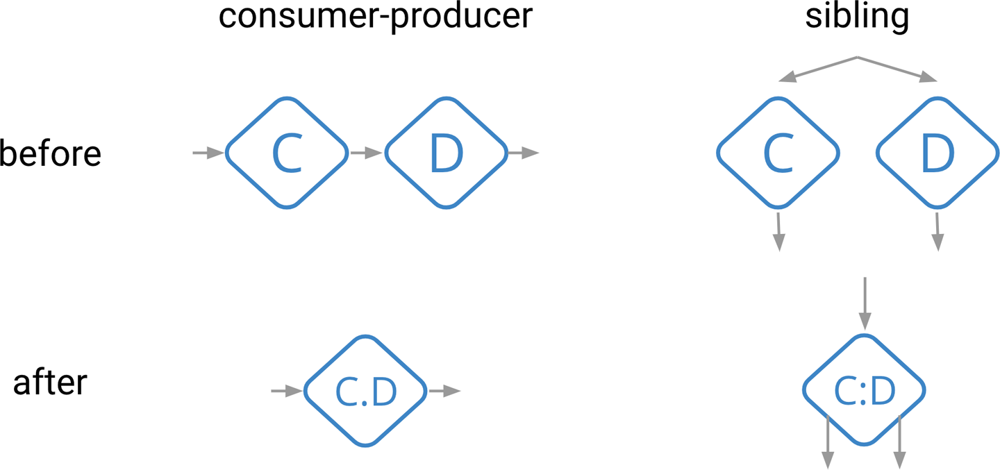

# Chapter 10. The Evolution of Large-Scale Data Processing

## MapReduce - Scalability & Simplicity

MapReduce在mit6.824中也有过详细分析，[见此](https://github.com/JasonYuchen/notes/blob/master/mit6.824/01.Introduction.md)，以及在[第六章](https://github.com/JasonYuchen/notes/blob/master/streamingsystems/06.Streams_And_Tables.md#mapreduce)中也介绍了思想

- **Data processing** is hard
- **Scalability** is hard
- **Fault-tolerance** is hard

MapReduce主要包括了六个环节：`MapRead, Map, MapWrite, ReduceRead, Reduce, ReduceWrite`，其核心过程可以抽象为三步：将表转换为流数据、在流上施加用户定义的转换来产生新的流、聚合流成为表

MapReduce的设计专注于**简易simplicity**和**可扩展scalability**，而距其诞生（以发表在OSDI 2004为起点到本书出版时间2017）已经度过了13年

## Hadoop - Open Source Ecosystem

MapReduce本身并没有开源，在2005年Doug Cutting和Mike Cafarella基于MapReduce的思想，实现并开源了Hadoop（Hadoop是GFS的开源实现，后者在mit6.824中也有过详细分析，[见此](https://github.com/JasonYuchen/notes/blob/master/mit6.824/03.GFS.md)）

Hadoop作为开源项目，对业界产生了深远影响，并以此为中心影响了整个**开原生态open source ecosystem**

## Flume - Pipelines with Optimization

在Google内部，Flume（有时候也被称为FlumeJava以便和Apache Flume）是MapReduce的继任者，主要解决了MapReduce的以下问题：

- 很多场合下，单次MapReduce无法解决问题，因此Google内部出现了各种**orchestration systems**来构建和调度一系列MapReduce任务，这些系统相互并不兼容，产生冗余和不便，**duplication of effort**
- MapReduce本身的接口设计极简，仅仅就是Map和Reduce，导致在多MapReduce任务协作时并不高效，有些场合下会出现多个串联的任务各自进行冗余不必要的shuffle，**性能劣化严重**
- 为了提高多个MapReduce任务的运行效率，工程师们着手进行手动优化，进一步增加了**维护成本**

Flume通过重新设计的API，能够定义流水线和多任务执行，并在内部通过优化器生成执行计划来解决这些问题

在Flume中最重要的优化主要就是[图优化](https://github.com/JasonYuchen/notes/blob/master/streamingsystems/05.Exactly_Once.md#%E5%9B%BE%E4%BC%98%E5%8C%96-graph-optimization)，包括：

- **融合fusion**
  **将逻辑上独立的阶段合并在同一个物理执行阶段**上，串行的前后阶段合并也称为consumer-produer fusion，并行的阶段合并也称为sbling fusion，这种融合极大的减少了序列化/反序列化、网络磁盘传输等代价

  

- **合并提升combiner lifting**
  **将聚合阶段的任务尽可能提前完成**，例如最后需要聚合求和所有节点的数据，则前序节点本地完成自身的数据聚合，将部分和发给聚合节点，避免每次产生一个数据都发给聚合节点，对于数据量非常大的热点数据，这种操作可以显著减小网络传输、聚合节点的计算等代价

  

Flume的成果发表在*FlumeJava: Easy, Efficient Data-Parallel Pipelines, SIGPLAN 2010*，随后Flume迁移到了**新的执行引擎Dax**上，标志着MapReduce在Google的谢幕，Dax不再受限于Map+Shuffle+Reduce的流程，从而能够执行更多的优化，例如**动态负载均衡dynamical work rebalancing**，也称为**液态分区liquid sharding**，当发现某些worker特别缓慢时可以动态将任务分配给其他节点从而降低整个任务的延迟

Flume对数据处理系统发展的主要贡献就是引入**流水线high-level pipelines**以及**自动优化automatic optimization**

## Storm - Low Latency with Weak Consistency

Apache Storm是一个业界普遍使用的流数据系统，其通过放**宽一致性约束（不保证强一致性）来实现低延迟**，Storm只提供最少一次/最多一次语义，并且没有持久化状态

这种设计使得Storm没有办法提供保证正确的结果，因此出现了著名的Lambda架构，即低延迟+不准确的流处理以及高延迟+准确的批处理，在那个时候的代表设计就是采用Storm+Hadoop，从而最终提供了**低延迟且保证最终一致性**的系统

在2015年，Storm最大的用户——Twitter决定放弃Storm，其继任者为Heron，解决了Storm多个性能和维护性的问题

## Spark - Strong Consistency

Spark在mit6.824中也有过详细分析，[见此](https://github.com/JasonYuchen/notes/blob/master/mit6.824/15.Big_Data_Spark.md)，Spark设计的RDD结构以及lineage执行计划，使得流水线的大量操作都可以在纯内存中完成，从而显著提升了数据处理的性能

Spark的设计假定了输入数据是可以**重放的replayable**，且计算是**确定性的deterministic**，从而周期性的快照以及失败任务重新执行就可以做到故障容错，这种假设在大多数场合下都是合理的，因此其突出的性能使得它成为了Hadoop事实上的继任者

Spark本身是批处理引擎，而当使用Spark来处理连续的数据，每一批数据都当作一次批处理，这样的**微批量micro-batch**设计就诞生了**Spark Streaming**，并且得益于底层的批处理引擎，Spark Streaming天然提供了强一致性保证，并且此时的延迟也非常低，从而可以单独取代Lambda架构

由于Spark Streaming基于微批量的设计，因此其延迟水平**per-key latency**依然会慢于真正的流处理系统，但是Spark本身的内存计算足够快，以及微批量使得延迟能够显著优于批处理系统，使Spark Streaming依然成为了第一个**公开可用、支持大规模流数据处理、提供强一致性保证**的批处理系统

## MillWheel - Out-of-order Processing

MillWheel是Google自研的通用流处理架构，可以做到**低延迟、强一致性保证、支持乱序**的无限流数据处理

- **真正的流 True Streaming**
  在流数据系统中有一个趋势就是简化编程模型，从而更易于实现与使用，例如Spark Structured Streaming和Apache Kafka都只局限于**物化视图语义materialized view semantics**，即逐条数据处理并相应更新一张最终一致性结果表，从而用户可以简单的直接通过查询该表来获知当前的结果状态

  有一些使用场景下，物化视图语义是不充分的，尤其是当用户需要**依赖输入数据的完整性completeness of input data**来做出一些判断或是执行一些操作时，此时物化视图语义下用户只能通过不断**轮询结果表来判断完整性——低效且难以扩展**
  
  **真正的流可以通过水印（通常指[低水印low watermark](https://github.com/JasonYuchen/notes/blob/master/streamingsystems/02.What_Where_When_How.md#when-allowed-lateness)）以及触发器的方式来支持这些依赖[输入完整性](https://github.com/JasonYuchen/notes/blob/master/streamingsystems/03.Watermarks.md#%E5%90%AF%E5%8F%91%E5%BC%8F%E6%B0%B4%E5%8D%B0%E7%9A%84%E6%9E%84%E5%BB%BA-heuristic-watermark-creation)的场景**，如果不支持这些特性那么也缺失了相应场景下的能力

MillWheel的核心思想如**一致性保证和水印**等发表在*MillWheel: Fault-Tolerant Stream Processing at Internet Scale, PVLDB 2013*，此后不久就被Flume吸收作为其新的流数据引擎，也被称为Streaming Flume

MillWheel在Google内也已经逐渐被其继任者Windmill替代，后者主要是保留前者的核心思想，从基础重写了整个处理架构，并且引入了更好的任务分配和调度策略

## Kafka - Durable Streams and Tables

在所有本章讨论的系统中，Kafka严格来说并不是一个流数据处理系统，而是一个传输系统（消息队列），但是kafka对流数据处理系统的发展有重大影响

kafka采用**分区日志partitioned logs**提供了**持久化的流数据传输persistent streaming transport**：

- 提供了**持久化的模型**，使用流式的接口包装了durable，replayable input sources
- 生产者与消费者之间**弹性的隔离层elastic isolation layer**
- 良好支持了**流和表**的关系
- 促进了stream-processing-as-databases和microservices的发展

kafka将数据库和批处理领域常见的**日志log应用到流数据处理当中，实现了durable、replayable的数据流**，使得流数据处理更加稳健可靠，同时也是**恰好一致语义exactly-once的基石**

## Cloud Dataflow - Unified Batch + Streaming

Cloud Dataflow是google内部基于云的数据处理服务，充分吸收了MapReduce，Flume，MillWheel的经验

Cloud Dataflow的核心就在于**统一了流处理和批处理unified batch plus streaming programming model**，即本书中讨论到的转换transformation，窗口windowing，水印watermark，触发器trigger，累积accumulation（即数据处理的四个问题：**what/where/when/how**），一些关键点包括：

- [非对齐的事件时间窗口 unaligned, event-time windows](https://github.com/JasonYuchen/notes/blob/master/streamingsystems/04.Advanced_Windowing.md#where-session-windows)，例如会话窗口
- [自定义的窗口支持 custom windowing support](https://github.com/JasonYuchen/notes/blob/master/streamingsystems/04.Advanced_Windowing.md#where-custom-windowing)
- [灵活的触发和累积方式 flexible triggering and accumulation modes](https://github.com/JasonYuchen/notes/blob/master/streamingsystems/02.What_Where_When_How.md#when-earlyon-timelate-triggers-ftw)，从而能够将数据塑造成所需要的形式，保证正确、低延迟、代价可控
- [水印 watermark](https://github.com/JasonYuchen/notes/blob/master/streamingsystems/03.Watermarks.md#chapter-3-watermarks)，用于检测输入完整性
- 逻辑上对底层处理引擎的抽象

Cloud Dataflow发表在了*The Dataflow Model: A Practical Approach to Balancing Correctness, Latency, and Cost in Massive-Scale, Unbounded, Out-of-Order Data Processing, PVLDB 2015*

## Flink - Open Source Stream Processing Innovator

由于Cloud Dataflow并没有开源，而Flink采纳了Cloud Dataflow中大多数设想并开源，成为了非常主流的流数据处理系统

Flink中最有特色的一点在于其**高效的快照算法highly efficient snapshotting**（Chandy-Lamport算法的衍生 *Distributed Snapshots: Determining Global States of Distributed Systems, TOCS 1985*），这个算法在第五章简要分析

Flink提供恰好一致语义并且支持乱序的事件时间处理，以及拥有**极高的处理性能**，在*Extending the Yahoo! Streaming Benchmark*中作者指出：

- 采用Flink重新建立Twitter当前基于Storm的处理系统时，可以达到更准确（exactly once）以及更低代价（~1%）
- 采用扩展后的流数据性能测试框架可以看出Flink（不启用exactly once）的吞吐量是Storm的7.5倍（解决网络瓶颈后达到40倍）

此后诸多流数据处理系统均采纳了Flink的一致性方案，并且Flink还基于自身独特的快照机制，实现了可以从**历史上任意一点重新启动整个处理系统的流水线**，参考[Savepoints: Turning Back Time](https://www.ververica.com/blog/turning-back-time-savepoints)，更深入的状态管理和快照机制发表在*State Management in Apache Flink: Consistent Stateful Distributed Stream Processing, PVLDB 2017*上

Flink的快速崛起来自于：

- 吸收了业界最领先的经验 （Dataflow/Beam）并开源整个系统
- 多项创新推动业界发展，例如通过特别的快照机制提供强一致性的访问，提供Streaming SQL的查询方式等

## Beam - Portability

Beam与本章节所有其它系统最不同的一点在于**Beam是一个编程模型，一个API抽象层，并不包括执行引擎**，如果SQL就是声明式的数据处理语言declarative data processing，则Beam就是**可编程数据处理语言programmatic data processing**

具体来说，Beam包括多个组件：

- **统一的流数据和批处理编程模型unified batch plus streaming programming model**，其之于Beam就相当于关系代数之于SQL
- **一组SDKs实现了整个编程模型**，可以采用这组SDK来顶与数据处理流水线，相当于SQL语言本身
- **一组DSLs基于SDK**s，提供了specialized interfaces that capture pieces of the model in unique ways，而SDKs则是包括了模型的每一方面
- **一组runners可以执行Beam定义的流水线**，将SDKs表达的逻辑流水线尽可能优化并转换为底层执行引擎支持的物理流水线，执行引擎例如Flink，Spark，Dataflow，可以将runner理解为执行SQL语言的数据库如MySQL，Oracle，Postgres

从而最终可以实现例如采用JavaScript SDK定义的流水线，可以由Haskell实现的runner来执行，即使Haskell没有任何直接执行JS代码的能力，即成为**数据处理届的"SQL"**

## Further Read

- MapReduce: Simplified Data Processing on Large Clusters, OSDI 2004
- The Google File System, SOSP 2003
- FlumeJava: Easy, Efficient Data-Parallel Pipelines, SIGPLAN 2010
- Twitter Heron: Stream Processing at Scale, SIGMOD 2015
- Resilient Distributed Datasets: A Fault-Tolerant Abstraction for In-Memory Cluster Computing, NSDI 2012
- MillWheel: Fault-Tolerant Stream Processing at Internet Scale, PVLDB 2013
- The Dataflow Model: A Practical Approach to Balancing Correctness, Latency, and Cost in Massive-Scale, Unbounded, Out-of-Order Data Processing, PVLDB 2015
- Distributed Snapshots: Determining Global States of Distributed Systems, TOCS 1985
- State Management in Apache Flink: Consistent Stateful Distributed Stream Processing, PVLDB 2017
