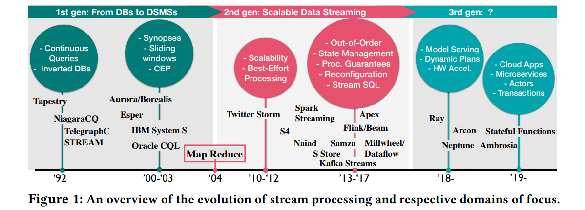
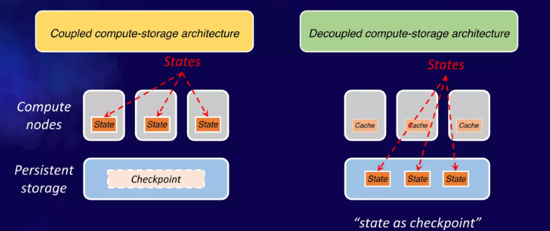
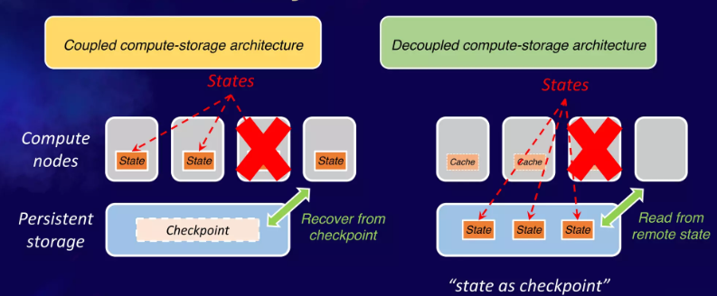
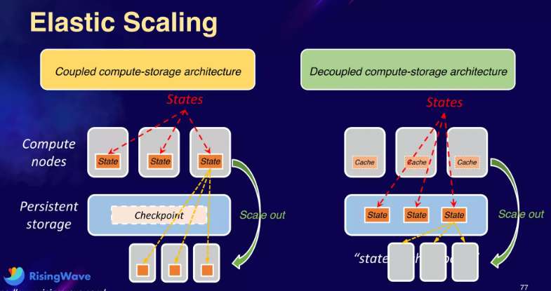

# Rethinking State Management in Cloud-native Streaming Systems

## Cost in Stream Processing

- Normal execution
- Failure recovery
- Elastic scaling

以上三点都牵涉到了最核心的一点：**状态管理State management**

## State Management

一个典型的join场景：两个流`Impression(adId, impressionTime)`和`Click(adId, clickTime)`在`adId`上连接出新的流`Output(adId, impressionTime, clickTime)`，则需要分别有**两个散列表来存储两个输入流的数据**并完成连接，这个过程中需要考虑：

- 高性能以及低簿记开销 high performance & small footprint
- 高效故障容灾 fast failure recovery
- 平滑的弹性扩容缩容 smooth elastic scaling

根据流数据系统的发展历史，可以简单分为三个阶段：单机时代、大数据时代、云时代

### Single Node Era

单机时代，上述的场景在单机中完成，内部状态（两个散列表）就存储在单机中，随着数据量的增加逐渐到达单机处理能力的上限

由于**所有状态都是单机存储**，并且系统也并没有为其他情况设计，此时除了采用更高性能的单机，没有其他解决方法

### Big Data Era

单个节点是最小的资源分配单元，一旦处理能力/存储资源不足，可以通过简单的增加更多的节点来应对，即弹性扩容

**存储计算耦合没有分离**，任一存在瓶颈都必须一起扩容，资源粒度比较粗糙，资源利用率难以做到极致

### Cloud Era

**计算资源和存储资源充分分离**（例如按需分别扩容AWS EC2和S3），更精细的资源利用，更弹性的扩缩容

以上述的例子为参考，假如计算资源不足（添加了海量的计算窗口、复杂计算等）可以单独扩容更多的EC2用于计算；假如存储资源不足（海量数据、宽表等）可以完全依赖于存储系统（S3）的自动扩容

这里引入了另一个问题就是**S3本身按照请求计费**，用于存储内部状态代价过高；同时**S3并不适合用于低延迟系统**

## Tiered Storage

与CPU多级缓存架构一样，云时代同样需要考虑多级存储，**为不同类型的数据找到最合适的存储介质**，例如AWS上：

- **EC2** volatile storage: **Hot data**
  - super fast
  - will get lost if not well replicated
- **EBS** semi-persistent storage: **Warm data**
  - fast
  - 99.999% durability
- **S3** persistent storage: **Cold data**
  - slow
  - 99.999999999% durability

可以采用**LSM**类型的数据结构来充分理由这类多级存储，将实时流数据**直接由EC2来接收并处理**，随后**compaction到EBS**上，再进一步**compaction到S3**上

- **small state**：则两种架构差别不大，存算分离架构中cache实际上就是完整的small state
- **big state**：则存算耦合架构中需要为这种big state提供足够强大的计算节点，代价非常高

## Failure Recovery

对于存算分离架构，由于计算节点本身只拥有cache，因此直接启动新节点进行容灾并读取存储节点的state即可，故障恢复时间可以大大缩短

## Elastic Scaling

- 存算耦合架构：对某个**过载的节点进行进一步的sharding**，从而获得更多的分区并用于新启动的节点
- 存算分离架构：唯一的扩容原因仅仅是计算能力不足（存储由S3等自动扩容），此时扩容时并**不需要对某个分区数据进行进一步sharding**（how?）

## Challenging Problems

### LSM tree compaction

**难以回避的[LSM compaction](https://github.com/JasonYuchen/notes/blob/master/papers/2019_VLDB_LSM_Survey.md#33-optimizing-merge-operations)导致的write stall和性能下降**，以及相应的CPU资源消耗

- **remote compaction?**
  > have tried lambda function to do the remote compaction, results are not good because the EC2 still have to **ship the data** to the remote machine (network IO)
- **scheduling mechanism to schedule the timing of a compaction wisely?**

### Cache miss

与传统CPU多级缓存架构相同，若**缓存未命中则会带来较大的性能惩罚**，例如需要访问S3来获取state

- **out-of-order processing**
  流数据中有非常多的潜在乱序、顺序无关消息，因此当处理一个消息时若发现可能会出现cache miss，则可以调整处理顺序、掩盖cache miss等方式来减轻cache miss的惩罚（思路与CPU乱序优化类似）
- **overlap fetching from S3 with computation**
  类似于批量处理或预读取的设计，一旦需要访问S3，则尽可能多存取数据来减少后续潜在的S3访问次数

### Implementing "state as checkpoint"

多个计算节点应该能够看到完全一致的state

- **MVCC**
  对每一行的数据都采用MVCC的方式来实现并发控制，采用epoch来识别的版本，从而确保不同计算节点能够选择一致的state

### Performance ?

对于基于云的系统，深度拥抱了云的弹性，往往核心在于成本、性价比的优化**maximize cost efficiency**，而不是在于性能performance（不代表性能不重要）
