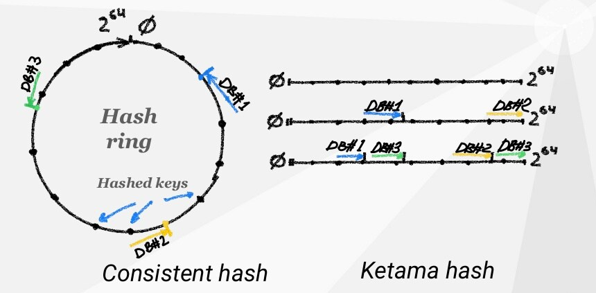
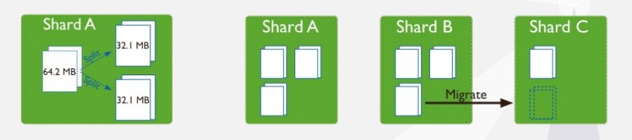
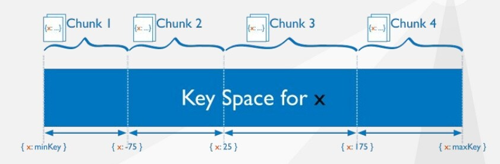
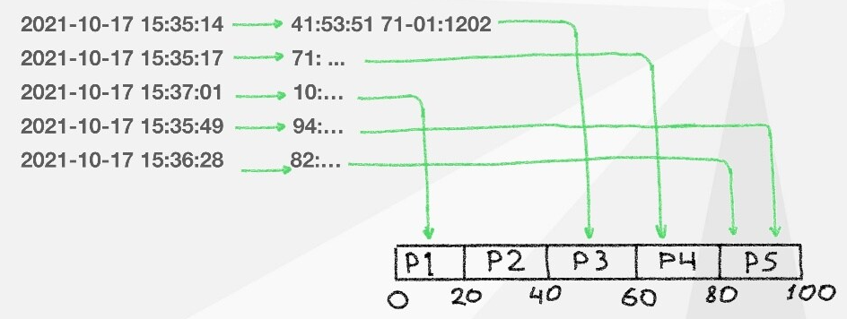
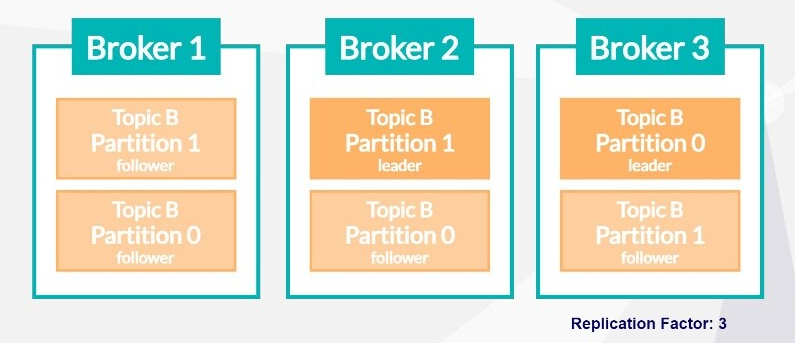

# Avoiding Data Hotspots at Scale

## RUM conjecture

数据的访问形式不能在以下三个方面都达到最佳（不可能三角）：

- **Read optimized**: point/tree indexes
- **Update optimized**: differential
- **Memory optimized**: compressible/appoximate

## Ways to shard

**分片shard指对数据进行水平分区horizontal partitioning**（另一种是垂直分区vertical partitioning），[见此](https://github.com/JasonYuchen/notes/blob/master/cmu15.445/13.Query_Execution_II.md#2-%E6%95%B0%E6%8D%AE%E5%BA%93%E5%88%86%E5%8C%BA-database-partitioning)

分片的核心难点在于：

- **分片算法**：选择一种分片方式将数据分割到多个节点上
- **数据倾斜与元数据维护**：数据的重新平衡并且维护所有数据的位置信息
- **请求的数据局部性**：将请求路由到数据所在的节点

||Hash|Range|
|:-|:-|:-|
|Write heavy/monotonic/time series|Linear scaling|Hotspots|
|Primary key read|Linear scaling|Linear scaling|
|Partial key read|Hotspots|Linear scaling|
|Indexed range read|Hotspots|Linear scaling|
|Non-indexed read|Hotspots|Hotspots|

### Hash-based sharding





**散列分区的优点在于能够将数据更为均匀的分到所有节点上，但是缺点在于对范围查询请求的响应必须所有节点都进行扫描**

### Range-based sharding



**范围分区的优点在于良好的支持范围查询请求，但是缺点在于数据难以均匀的分散到所有节点上，同时对某一个范围内的查询较热时这些请求很可能都需要同一个节点来服务，造成请求热点**

## Avoid hotspot

- **Bit-reversing the partition key**
  对于范围分区的范式来说，由于分区键是连续的，那么可以通过**位反转**的方式构造出类似散列的随机分布的键，如下高位总是`2021....`，而低位非常随机，通过整体位反转就可以获得随机均匀分布的数据

  这种方式**仅对范围分区下连续的主键有效**，而对二级索引、物化视图就没有作用

  

- **Compound keys**
  通过组合键的方式可以将更多维度的信息编码进主键，从而进一步对数据进行分割和分区，避免热点的出现，在Cassandra/ScyllaDB中还有一种**clustering key的策略是根据key的第一个component进行散列分区，而在每个分区内的数据又根据key的第二个component进行排序**，这种模式也被称为**key-key-value系统**（类似**多级分区**模式下的一级散列分区、二级范围分区，多级分区的设计需要对数据的访问模式进行深入的分析）

  例如下面这种方式设计分区，就可以使得所有用户之间的访问日志被独立的散列分散到不同节点上，而每个用户在节点内部则是按时间顺序保存访问日志，从而可以高效支持例如”获取A用户最近10次访问“这种查询请求

  ```SQL
  CREATE TABLE UserAccessLog (
      UserId          INT64 NOT NULL, 
      LastAccess      TIMESTAMP NOT NULL,
      ...
  ) PRIMARY KEY (UserId, LastAccess DESC);
  ```

- **Replicating dimensions**
  **当一个分区表的维度并不多时，将每个维度单独成表，以星形的方式重新组织原表，并且每个维度表都复制保存到所有分区上**，通过这种方式可以尽可能**减少跨分区的连接**（跨分区连接很有可能会导致大量跨网络数据传输），例如一个销售数据表，采用产品代码作为主键，则可以直接将产品代码、目录和全名作为一个子表，这个子表非常小且修改变化很不频繁，就可以在每个分区中都保存一份这个子表，从而当不同分区需要连接时，只需要直接连接分区内部的子表即可：

  ```TEXT
  --------------------------------------------------------------
  |ProductCode|Category|FullName|Timestamp|Buyer|Quantity|Price|
  |-----------|--------|--------|---------|-----|--------|-----|
  |    ABC    |   X    | abcdef | 19.02.44|  a  |  12345 | 23.4|
  |    ABC    |   X    | abcdef | 19.02.43|  b  |  22234 | 23.4|
  |    DEF    |   Y    | defghi | 19.02.42|  c  |  11235 | 55.8|
  |    DEF    |   Y    | defghi | 19.02.41|  d  |   3245 | 56.4|
  |    ABC    |   X    | abcdef | 19.02.40|  e  |     15 | 23.2|
  |    ABC    |   X    | abcdef | 19.02.39|  f  |  93345 | 23.3|
  |    GHI    |   X    | ghijkl | 19.02.38|  g  |    345 | 25.7|
  |    GHI    |   X    | ghijkl | 19.02.37|  h  |     22 | 24.4|
  |    ...    |  ...   |  ...   |    ...  | ... |   ...  | ... |
  --------------------------------------------------------------

  -------------------------------
  |ProductCode|Category|FullName|
  |-----------|--------|--------|
  |    ABC    |   X    | abcdef |
  |    DEF    |   Y    | defghi |
  |    GHI    |   X    | ghijkl |
  -------------------------------
  ```

  这种方式更像是**良好的数据建模**，但是通过分布式数据库本身的特殊支持，使得拆分出部分小表后整体性能提升

## Special cases

### Scaling a message queue

参考Kafka的topic和partition设计，对于消息队列来说（假如不要求整个队列严格的FIFO）可以从两个维度进行分区和水平扩容，第一就是**消息的时间戳**（Kafka设计了**分段式日志segmented log**来支持这种时间单调递增的存储场景），第二就是**消息本身的分类即topic**



### Scaling in a data warehouse

数据仓库的特点在于不要求严格的唯一性约束也没有OLTP的ACID要求，数据可以在不同维度上多次排序，因此也可以组合多个维度构建更复杂的分区键对数据进行分区，数据也可以存储多份以应对不同形式的访问，因此从RUM猜想的角度来说是read/write optmized
