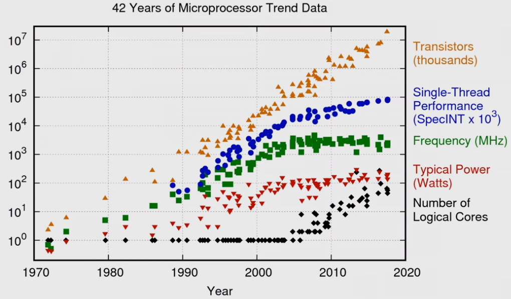
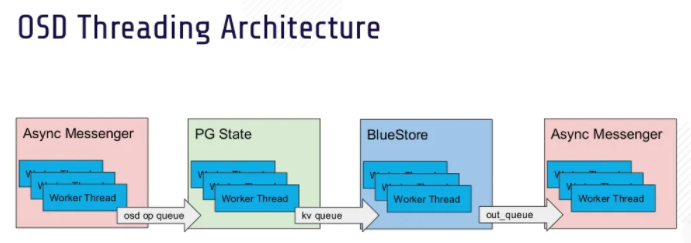
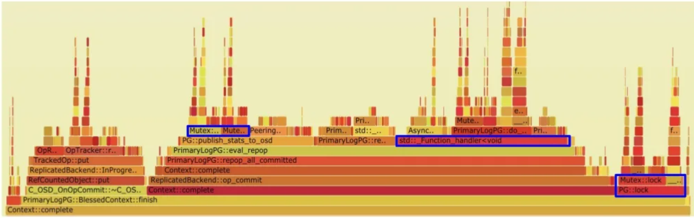
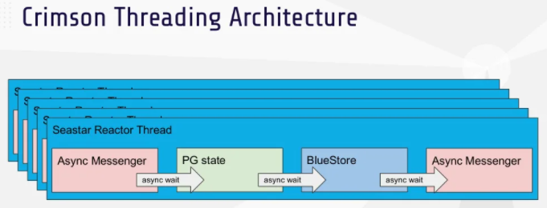
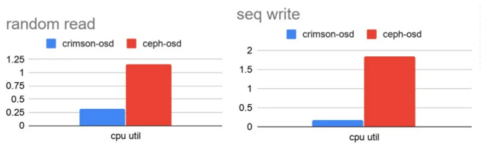

# Crimson: Ceph for the Age of NVMe and Persistent Memory

## Storage Getting Faster

对于一个3GHz的CPU来说，可以负载：

- HDD: ~20,000,000 cycles/IO
- SSD: ~300,000 cycles/IO
- NVME: ~6000 cycles/IO

随着存储设备的发展，单次IO的延迟越来越小，对CPU的压力越来越大

## Ceph Rados

- Monitor
  - 鉴权、数据存放策略
  - 所有其他集群组件的协调
  - 采用PAXOS协议对核心数据状态实现复制
  - 通常每个集群有3、5、7个Monitor
- Object Storage Daemon, OSD
  - 单机存储管理，管理HDD、SSD
  - 服务用户的IO请求
  - 协调节点间的复制、负载均衡、数据重平衡
  - 通常每个集群有10-10000个OSD

## Classic OSD Architecture

- **Async Messagenger**：传输模块，用于节点之间通信以及节点与前端请求交互，内部采用线程池的机制
- **PG State**：数据状态管理模块，用于数据存放、管理、恢复，确保数据的一致性，内部采用线程池的机制
- **BlueStore**：数据存储引擎模块，与存储设备交互，以KV的形式存储所有数据，内部采用线程池的机制

可以看出传统OSD的线程模型大量采用了线程池的设计，并且**锁占用了绝大多数的时间**：

## Crimson

新一代存储后端Crimson旨在拥抱新硬件并显著提升系统性能，基于[Seastar](https://github.com/JasonYuchen/notes/blob/master/seastar/Introduction.md)实现以下目标：

- **Minimize CPU overhead**
  - Minimize cycles/iop
  - Minimize cross-core communication
  - Minimize copies
  - Bypass kernel to avoid context switches
- **Enable emerging storage technologies**
  - Zoned Namespaces
  - Persistent Memory
  - Fast NVME

## Roadmap

- **Tech Preview**
  - Replication
  - Peering/Recovery/Backfill
  - RBD workloads
  - Multi-reactor threads
- **Near Future**
  - RGW/CephFS
  - Erasure coding
  - Snapshots
- **Far Future**
  - Seastar
  - SPDK and/or io_uring
  - Networking
