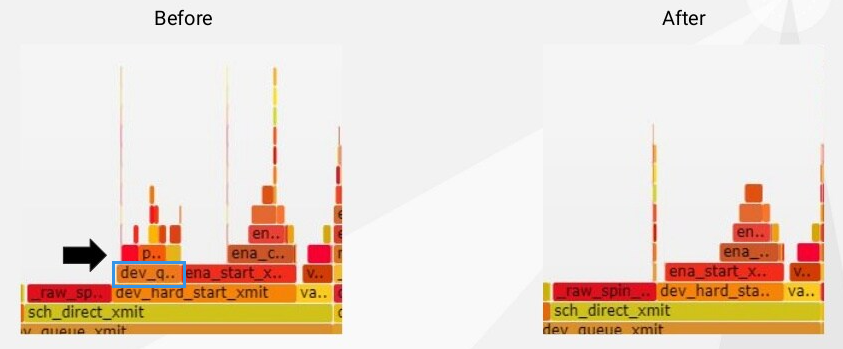
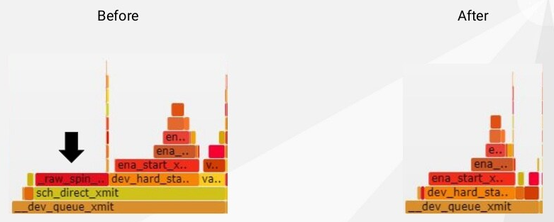

# Extreme HTTP Performance Tuning: 1.2M API req/s on a 4 vCPU EC2 Instance

[original talk](https://www.p99conf.io/session/extreme-http-performance-tuning-1-2m-api-req-s-on-a-4-vcpu-ec2-instance/)

## Groud Zero

**Gain 0%, 224k Req/s, P9999 1.32ms**

- 硬件配置：4 vCPU c5n.xlarge as server，16 vCPU c5n.4xlarge as client
- 软件配置：libreactor的HTTP `helloworld`，每次请求只返回一个json对象

## Application Optimizations

**Gain 55%, 347k Req/s, P9999 1.08ms**

火焰图中红色为内核部分，蓝色为用户部分，**细高的红色部分为入流请求中断相关的处理程序**，蓝色的用户部分相比**水平更窄**意味着开销占比更低、**垂直更低**代表着编译器更激进的内联优化降低了调用栈深度，而能够处理更多的请求即更多的中断也导致了更多的细高红色部分（interrupt-driven mode）

主要优化在于应用程序的编译和运行：

1. 在所有核心上运行程序：25%
2. 编译优化`gcc -O3 -march=native`：15%
3. 更高效的系统调用`send/recv`替换`write/read`：5%
4. libthread采用线程池进行dns解析，而对于server端程序来说是不必要的，移除这部分额外开销：3%

## Disabling Security Features

**Gain 74%, 603k Req/s, P9999 575us**

停用Linux内核的安全特性之一（不推荐的优化方式）

1. Speculative Execution Mitigations：28%

   [spectre/meltdown](https://meltdownattack.com/)补丁显著提升了syscall的开销

   `nospectre_v1 nospectre_v2 pti=off mds=off tsx_async_abort=off`

2. Disabling Syscall Auditing / Blocking：11%

   `auditctl -a never,task`

   `docker run -d --security-opt seccomp=unconfined libreactor`

3. Disabling iptables / netfilter：22%

   `modprobe -rv ip_tables`

   `ExecStart=/usr/bin/dockerd --bridge=none --iptables=false --ip-forward=false`

停用推断执行安全补丁能整体提升性能，因此在火焰图中没有明显提升的部分，而系统调用监听和网络过滤的停用能够明显看出（途中粉红色部分）

## Perfect Locality

**Gain 77%, 1.07m Req/s, P9999 348us**

- **完美局部性 Perfect Locality**
  - 将libreactor的处理线程绑定到指定的CPU上，每个vCPU都有一个processor，即seastar的[TPC设计](https://github.com/JasonYuchen/notes/blob/master/seastar/Introduction.md#shared-nothing-design)
  - 将网卡队列绑定到指定CPU上，即`processor <-> vCPU <-> network queue`（RSS+XPS）
  - 采用`SO_REUSEPORT`和`SO_ATTACH_REUSEPORT_CBPF`，通常服务器程序会端口重用允许多个线程监听同一个端口，而内核在处理连接时会随机选择一个监听的线程完成连接，这样会打破原先设计的网卡端口到vCPU到processor的映射，新的内核中可以**采用bpf程序要定义端口重用时的连接策略**，从而保证负责中断处理程序（irq）的CPU一定就是将数据传递给用户侧的CPU，也是libreactor处理数据的CPU
- **中断优化 Interrupt Moderation**
  - `ethtool -C eth0 adaptive-rx on`，当有大量数据时会引发大量中断请求导致降低了CPU的实际处理效率，而现代网卡支持优化中断使得**允许延迟中断**，从而允许多个请求在一次中断中完成处理，即批量化处理，类似TCP的**Nagle算法**，同时网卡通常支持动态中断优化根据请求速率调整延迟时间
- **轮询模式 Busy Polling**
  - `net.core.busy_poll=1`，CPU会不等待中断而是主动发起轮询查看是否有需要处理的数据包，从而最大程度上减少中断发生的概率

显然代表着中断的细高红色部分显著减少，并且在中断可能发生的点之前就已经通过轮询将大量请求处理完成

## The Case of the Nosy Neighbor

**Gain 6%, 1.12M Req/s, P9999 341us**

有一些程序会在不经意间监听数据包，带来开销：

1. `dev_queue_xmit_nit()` -> `packet_rcv()`
2. `packet_rcv()`涉及`AF_PACKET`：内核源码中假定可能有第三方例如`tcpdump`在监听所有数据包，从而采用`AF_PACKET`并可以通过bpf过滤器来选择感兴趣的数据包来监听
3. `sudo ss --packet --process` -> `(("dhclient",pid=3191,fd=5))`：通过这种方式发现`dhclient`正在监听http服务器，关闭并可以提升一定性能（**通常这种监听并不会带来很高的开销**，但是当请求数达到1M req/s时就变得显著）

图中可以看出`dev_queue_xmit_nit()`原先占用3%的开销，当`dhclient`被关闭后完全消失

## The Battle Against the Spin Lock

**Gain 2%, 1.15M Req/s, P9999 338us**

## This Goes to Twelve

**Gain 4%, 1.20M Req/s, P9999 317us**

进一步修改一些配置来提升这种场景的性能表现，并不推荐，可能在其他场合反而劣化性能

- 关闭Generic Receive Offload, GRO：GRO用于聚合数据包并重新组装给应用层，当下场景的请求数据一定可以放在单个数据包中因此不需要GRO来重新组装
- TCP拥塞算法用`reno`替换`cubic`：通常在广域网上较重要，参考[Google BBR算法](https://en.wikipedia.org/wiki/TCP_congestion_control#TCP_BBR)，而在数据中心内部通常不是非常重要，采用`reno`算法的开销最低
- 静态终端优化 Static Interrupt Moderation

## 其他可以考虑的问题

- Next gen kernel
- Next gen technologies: [io_uring](https://github.com/JasonYuchen/notes/blob/master/linux/io_uring.md#io_uring)
- Next gen instances: ARM vs Intel vs AMD
