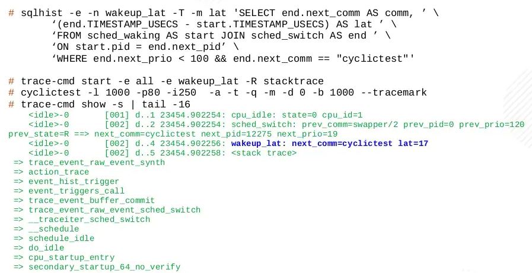

# New Ways to Find Latency in Linux Using Tracing

## ftrace

[original talk](https://www.p99conf.io/session/new-ways-to-find-latency-in-linux-using-tracing/)

ftrace从2008年开始成为Linux Kernel的official tracer，此前所采用PREEMPT_RT主要致力于找到延迟点而无法大规模在生产环境中使用，其额外的开销过大，并且每次开启和关闭tracer都需要重新配置编译安装内核

**ftrace致力于在生产环境中使用，并且在关闭时几乎不引入额外开销**，但是其早期设计的使用方式不够友好，通过文件系统来配置启用和停用tracing，并且从文件系统中获取结果，例如：

```sh
>> mount -t tracefs nodev /sys/kernel/tracing

>> ls /sys/kernel/tracing
available_events            buffer_total_size_kb   error_log                 instances        per_cpu              saved_tgids         set_ftrace_pid      stack_trace         trace_clock       trace_stat           uprobe_events
......

>> ls /sys/kernel/tracing/per_cpu/cpu0
buffer_size_kb  snapshot  snapshot_raw  stats  trace  trace_pipe  trace_pipe_raw

>> cat /sys/kernel/tracing/per_cpu/cpu0/stats
entries: 0
overrun: 0
commit overrun: 0
bytes: 0
oldest event ts:     0.000000
now ts: 22300873.756945
dropped events: 0
read events: 0
```

## trace-cmd

[trace-cmd](https://www.trace-cmd.org)作为ftrace的前端工具，可以大大简化对ftrace的操作，从而不需要直接操作tracefs目录

### the old tracers

- **wake up tracer**
  - all tasks
  - real-time tasks
  - deadline Tasks
  
  ```text
                   |<    latency     >|
   wake up Task 2->|                  |
             | interrupt |            |
  |----------^           v------------|          |
  |<           Task 1                >|< Task 2 >|
                                      |<- schduler switch
  ```

  采用trace-cmd的方式来运行wake up tracer：

  
  
  - `-p`：代表plugin，即启动某个tracer
  - `5.10.52-test-rt47`：内核版本，`rt47`说明是real-time kernel
  - `rt_prio:1`：优先级为1，说明是高优先级任务

- **preemption off tracers**
  - **irqsoff tracer**
  - **preemptoff tracer**
  - **preemptirqsoff tracer**

  ```text
  
                   |< latency >|      
    irqs disabled->|           | interrupt |
  |----------------------------^           v-----|
  |<               Task        |                >|
                               |<-irqs enabled
  ```

  采用trace-cmd的方式来运行preemption off tracer：

  

  - `started at: _raw_spin_lock`：在自旋锁加锁时停止中断抢占
  - `ended at: _raw_spin_unlock`：在自旋锁解锁时重新开启抢占

  

  - `-d`：关闭函数级别的追踪
  - `-O sym-offset`：加上函数调用时的栈上偏移量，从而可以采用gdb等方式通过偏移量找到实际函数调用的位置

对于以上的tracer有一些问题：

- 无法控制追踪哪个任务，只能追踪最高优先级的进程，例如追踪realtime task，无法指定只追踪某一个task
- 不够灵活

### synthetic events

**合成事件synthetic events指将两个事件映射为一个延迟**，即这两个事件之间的时差，例如：

- `sched_waking      + sched_switch     -> wakeup_latency`
- `irqs_disabled     + irqs_enabled     -> irqs_off_latency`
- `irq_enter_handler + irq_exit_handler -> irq_latency`

采用libtracefs和tracefs_sql来**用SQL-like语言"查询"感兴趣的延迟**：

```sh
>> sqlhist -e -n wakeup_lat -T -m lat \
  'SELECT end.next_comm as comm, (end.TIMESTAMP_USECS - start.TIMESTAMP_USECS) AS lat ' \
      'FROM sched_waking AS start JOIN sched_switch AS end ' \
          'ON start.pid = end.next_pid ' \
      'WHERE end.next_prio < 100 && end.next_comm == "cyclictest"'
```

- `-e`：执行并基于SQL捕获延迟
- `-n`：生成一个合成事件称为`wakeup_lat`
- `-T`：代表当发现符合的合成事件时就会触发trace，并且对当前的ring buffer进行snapshot
- `-m`：代表仅在latency创新高时才进行记录
- `cyclictest`：用来测试实时系统中延迟的测试程序

```sh
>> trace-cmd start -e all -e wakeup_lat -R stacktrace
```

- `-e all`：记录所有event的发生，不仅仅是synthetic event
- `-e wakeup_lat -R stacktrace`：仅当wakeup_lat发生时才进行stack trace

```sh
>> cyclictest -l 1000 -p80 -i250 -a -t -q -m -d 0 -b 1000 --tracemark
>> trace-cmd show -s | tail -16
```

- `-s`：只展示snapshot的结果，不关心运行中的ring buffer




