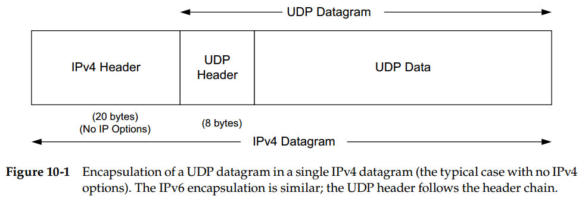
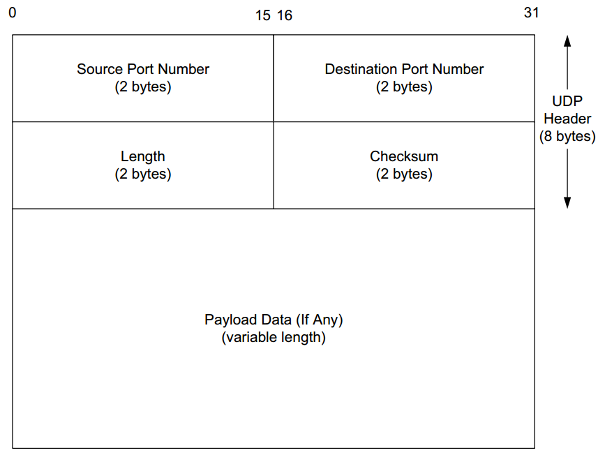
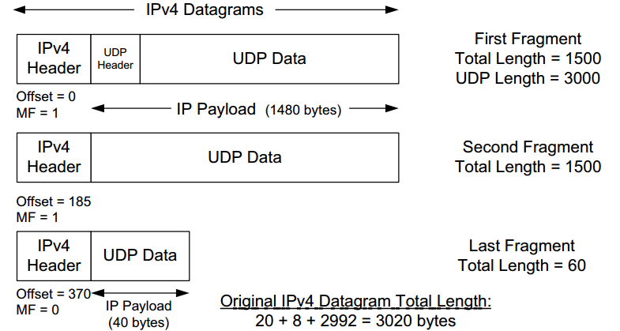

# Chapter 10. User Datagram Protocol (UDP) and IP Fragmentation

## Introduction

## UDP Header

- IP头的`Protocal`可以指明内部数据应该由什么协议来处理，体现了**多路复用的思想IO Multiplexing**，因此只要处理的协议不同，可以相同的`IP:PORT`，`PORT`是2 bytes，因此至多有65536个端口号
- UDP头的**长度字段是冗余的**（IPv4/IPv6），因为UDP头长度固定为8个字节，而IP头包含有UDP的长度，因此UDP头的长度字段应该始终等于IP头长度字段-8

## UDP Checksum

- UDP校验和**覆盖了UDP头部、UDP数据、伪头部**
- IPv4头部的校验和**只覆盖IP头部**，并且在**每个IP跳都要重新计算**（TTL字段每一跳都被路由器减少）
- IPv6不提供IP的校验和，因此UDP的校验和是必须的
  由于IPv6支持**超长数据报（>65536 bytes）**，因此当超长时UDP头的长度字段会被置0，真正的长度通过IPv6头的长度字段推断得到

## IP Fragmentation

- IPv4允许过长的IP数据报在途中被分片传输，但是**IPv6只允许主机进行分片**
- IPv4被分片后直到**达到最终目的地才会被重组**
  - 在网络中不进行重组对路由器等软硬件的负担要小
  - 同一数据报的不同分片可能经由不同的路径抵达最终目的地
- 一个链路层帧能承载的最大数据量叫做**最大传送单元MTU**，当IP数据报大小超出MTU时，就需要分片成多个较小的IP数据报
  - 发送主机通常将发送的每个数据报标识号加1
  - 当某个路由器需要分片时，每个分片后小数据报具有**初始数据报的源地址、目的地址与标识号**，同时最后一个片的标志位是0其余片的标志位是1，偏移字段offset来指定该片应该在原数据报的哪个位置
  - 当数据报到达目的时在IP层就已完全重构为初始数据报，若**有片出错或丢失，则整个数据报被丢弃**而不会传给运输层，通过接收到第一个分片后启动定时器检测**超时来识别是否丢失**
  - 除最后一片外，所有初始有效载荷数据的数据量应该是8 bytes的倍数，偏移量的值是有效载荷/8
  
  
- 分片需要每个分片都有一个**额外的IPv4 header以及offsert**，同时一旦某个分片丢失会导致整个数据报丢弃，带来**显著的性能问题**

## Maximum UDP Datagram Size

- 理论上，16位长度字段指出UDP（不考虑IPv6超长数据报）最多可以有65507(IPv4)/65527(IPv6)大
- UDP编程接口允许应用指定每次读取一个数据报的长度，则当数据报超过应用指定的长度时，以下三种情况取决于操作系统具体实现：
  - 截断，直接丢弃超额数据
  - 留下超额数据给后续的读操作
  - 截断但是通知被接断的数据数量

## UDP Server Design

- **IP address和UDP port**
  通过操作系统可以得知发送方的`IP:PORT`（如果对方不需要回复，`PORT`可以是0），因此可以根据对方的`IP：PORT`进行分别处理，同时服务多个client
- **限制本地IP address**
  - 一般服务器创建UDP时会**使本地IP地址具有通配符**（如local address=*:7777）的特点，即在该服务器上的任何本地接口均可接收到
  - 建立UDP时也可以**指定一个本地IP地址**（包括一个广播地址，如local address=127.0.0.1:7777）作为该UDP端口的本地IP，只有目的IP匹配的UDP数据报才会被转发到这个端点
- **使用多个地址**
  创建socket时使用`SO_REUSEADDR`选项，使得**同一个端口号**开启几个不同的服务程序使用**不同的本地IP地址**

  注意：同时有通配符地址和精确地址时，**优选匹配精确地址的端点**，若没有则再使用通配符端点
- **限制远端IP地址**
  只接收指定的远端`IP:PORT`发来的数据报，限制远端IP时而没有指定本地地址时，此时本地地址会被默认自动选择
- **每端口启动多个服务器**
  创建socket时使用`SO_REUSEPORT`选项，使得多个服务程序**共享同一个端口，数据抵达时内核会自动挑选一个服务程序**
- **跨越地址族：IPv4和IPv6**
  在Linux中，所有**端口空间都是共享的**，所有的**通配符IPv6绑定意味着对应的IPv4绑定**
- **缺少流量和拥塞控制**
  UDP协议没有流量控制和拥塞控制机制
