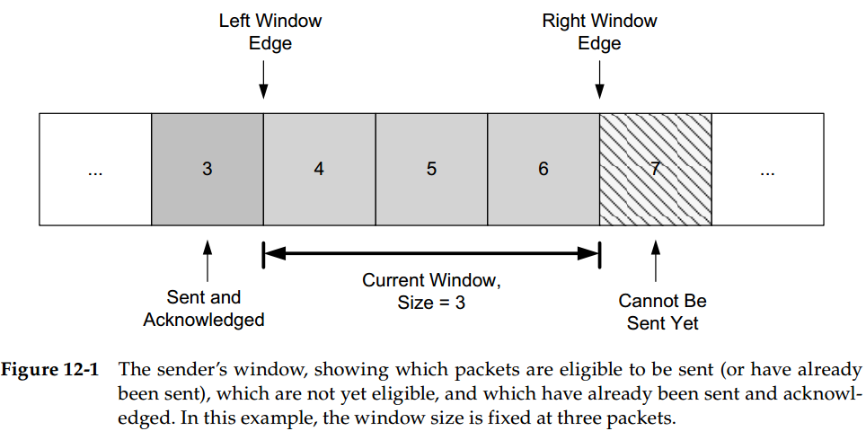
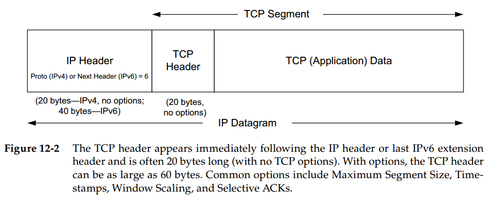
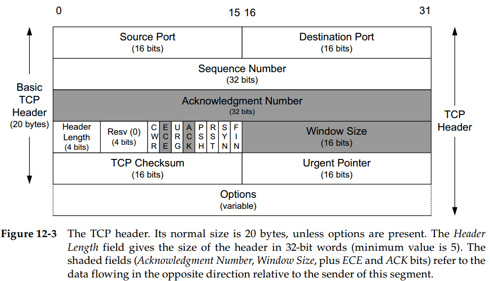

# Chapter 12. TCP: The Transimission Control Protocol (Preliminaries)

## Introduction

- ARQ和重传：通过ACK来确认接收，并对超时的进行重传
- 分组窗口和滑动窗口：一次发送多个分组以提高网络利用率，批量发送批量ACK批量重传
- 变长窗口用于流量控制和拥塞控制
- 设置重传超时

## Introduction to TCP

- **TCP服务模型**
  TCP提供了一种**面向连接的、可靠的字节流**服务
- **TCP可靠性**
  - 维持一个**强制的校验和**，带有无效校验和的包被直接丢弃，不会ACK
  - 发送一个窗口的数据就会设置一个计时器，ACK到达时更新，**超时就重发**没有ACK的包
  - 接收到数据时会回复一个带有字节指示N的ACK，指示N代表在N之前的所有字节都被成功接收，**累积确认**
  - 双工服务，并且保证字节流的发送顺序就是接收顺序，即**有序性**

## TCP Header and Encapsulation

- **头部长 Header Length**：标识TCP头部的长度，自身4位，头部必须字段占20字节，加上可选字段占60字节
- **序列号 Sequence Number**：标识了TCP发送端到接收端的数据流的字节编号（即报文段首字节的编号），**超过32位大小后重新从0开始**
- **确认号 Acknowledgment Number**：标识了下一个期望收到的字节编号，由于TCP是累积确认的，因此即使收到了更后面的报文段，也不能确认，例如收到1-1024和2048-3072则ACK1025，而不能对3073确认（选择确认和重复确认可以显著改善性能，并帮助实现拥塞控制和差错控制过程）
- **数据载荷 TCP Application Data**：报文段的数据部分是可选的
  - 一个连接**建立**或**终止**时使用的报文段就不带有数据
  - 不带任何数据的报文段也可以用于**纯ACK**，同时通知通信方**修改窗口大小**
- **SYN**：建立新连接时第一个报文段的SYN位启用，简称为**SYN包**，此时的序列号包含了本次连接本方向上的**第一个序列号**（为了安全不是0/1，而往往**随机生成**）
- **FIN**：表示该报文段的发送方结束发送数据（TCP四次挥手`>FIN  <ACK  <FIN  >ACK`）
- **CWR**：拥塞窗口减小，提示发送方降低发送速率
- **ECE**：ECN回显，发送方接收到了更早的拥塞提示
- **URG**：紧急指针字段有效，很少被使用，紧急指针字段用来标识紧急数据位置
- **ACK**：确认号字段有效，建立连接以后一般都是启用状态
- **PSH**：推送，接收方尽快向应用层推送这个数据，没有被实际实现和使用过
- **RST**：连接重置，因为错误或是数据不匹配而重置连接
