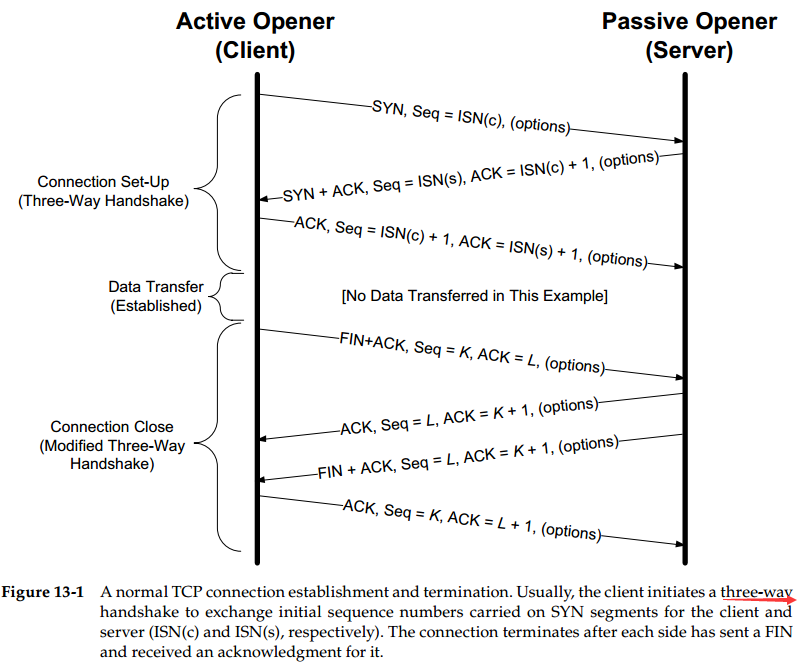
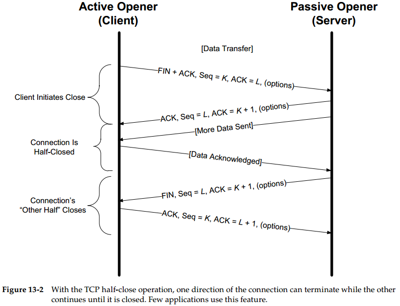
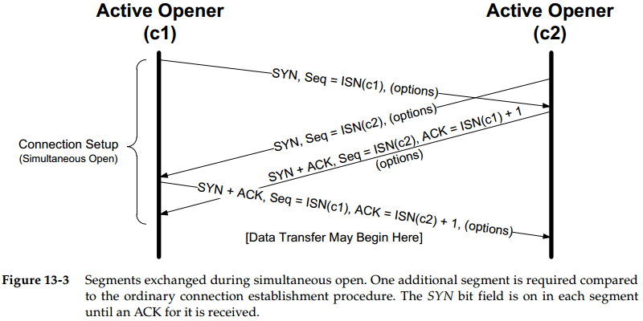
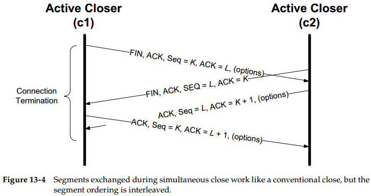
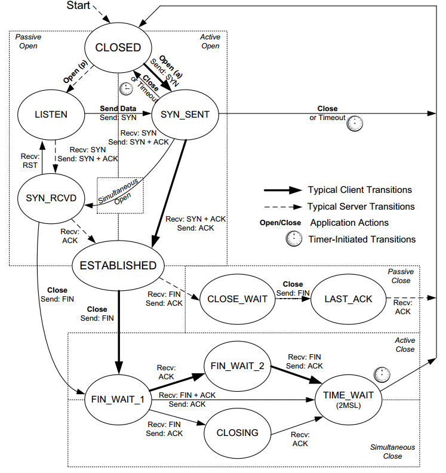

# Chapter 13. TCP Connection Management

## TCP Connection Establishment and Termination

- **连接建立**
  1. client发送`SYN`给server（主动打开**active open**），并带有随机初始化的client Seq以及一些选项
  2. server发送`SYN+ACK`给client（被动打开**passive open**），并带有随机初始化的server Seq以及一些选项
  3. client发送`ACK + (optional) data`给server，此时连接已经建立并可以交互
  
- **连接终止**
  1. 任意一方例如client（主动关闭**active close**）发送`FIN+ACK`给server，这里`ACK=L`是server向client发的最后`Seq+1`
  2. server（被动关闭**passive close**）发送`ACK`给client，此包的`Seq=L`，此时**通知上层应用远端已经close**
  3. server在收到`FIN`的通知后也会发送`FIN+ACK`给client，这里`ACK=K+1`就是此前client发的`FIN`的`Seq+1`
  4. client发送`ACK`给server，这里`ACK=L+1, Seq=K`，连接完全关闭
  

  注意：连接终止需要两方各一次`FIN+ACK`，这是因为**TCP是双工的**，因此关闭每一个方向需要一次`FIN+AC`K，当TCP连接只有一个方向在工作时，又叫**半开连接（half-open state）**
- **半关闭 half-close state**
  **通过`shutdown()`实现单方向关闭即半关闭**，通过`close()`会实现完全关闭

  当单向发送数据方如上图server（图中More Data Sent）也结束发送时，就会使用`close()`，发送一个`FIN`，此时client会收到`EOF`（read 0）
- **同时打开连接**
  此时会有**四个`SYN`发送**，随后建立起完全的连接交互数据，**比三次握手多发送一个报文段**
  
- **同时关闭连接**
  此时与正常关闭一致，同样是两对`FIN+ACK`
  
- **初始序列号 Initial Sequence Number, ISN**
  由于TCP是四元组`(ip, port, peer-ip, peer-port)`来标识，无法区分时间上的先后，因此`ISN`必须可靠选择，**防止上一个连接在途中的报文段抵达peer时被新连接误作为当前连接的有效数据**而接收（通过ISN来区分，要避免ISN出现overlap）

  ISN需要**足够随机，避免被干扰**（只要选择对了TCP四元组+`ISN`，就可以伪造报文段来干扰真正的通信）
- **建立连接超时**
  当向一个不存在的站点试图建立连接时（发送`SYN`）会发生**指数回退exponentional backoff的超时重试**，即第二次`SYN`在第一次的3s后发，第三次`SYN`在第二次的6s后发，再下次12s后发，直到93s发送第6次，93+96=189s后真正超时，建立连接失败

## TCP Options

- **最大段大小 Maximum Segment Size, MSS**
  指TCP协议所允许的从对方接收到的最大报文段，只记录TCP数据的字节数，不计入头部，建立TCP连接时双方**在SYN报文段中指明MSS值**
- **选择确认 Selective Acknowledgment, SACK**
  - TCP是累积确认的，则即使收到了更新的数据，只要中间有未收到的，就只能ACK中间的部分，如果能够ACK其他已经收到的数据，就有利于发送方快速发送缺少的空洞部分，提高效率，这就是选择确认，通过**在`SYN`报文段中启用选择确认**
  - 选择确认选项是变长的，包括N个`SACK`块，每一块8 bytes由一对32位的序列号表示已经成功接收到的数据范围，另有2 bytes保存`SACK`选项的种类和长度，一共长`8N+2` bytes
  - 通常都会包含时间戳选项TSOPT, 10 bytes并且只需要`SYN`中包含了允许选择确认即可，因此**一个报文段包含的`SACK`最多为3块**，`3*8+2+10=36<40` bytes（**选项最多40 bytes**）
- **窗口缩放因子 Window Scale, WSOPT**
  - TCP头部的**Window Size保持16bits**不变，通过窗口缩放的值直接左移s位（0-14），可以表示16-30bits的窗口，TCP使用一个32 bits的数来维护缩放后的真实Window Size
  - `WSOPT`只能出现在`SYN`报文段中，且通信双方都要在`SYN`中提供`WSOPT`，每次发送数据时Windows Size需要根据自身的缩放因子右移再填充满16bits，而接收数据时Windows Size也要根据对方的缩放因子左移再获得真实值
  - TCP根据**接收缓存的大小自动选取缩放因子**，应用程序可以通过改变缓存的大小来影响WSOPT的值
- **时间戳 Timestamps, TSOPT**
  - 发送方可以在`TSOPT`中填充2个4 bytes的时间戳数值，接收方会在对应的`ACK`中反映这些数值，允许发送方**对每一个接收到的`ACK`估算Round-Trip Time, RTT**（由于累积确认和选择确认，TCP可以一个ACK确认多个报文段），从而调整超时重试的时间
  - 使用`TSOPT`时，**发送方将4 bytes的数值填充到`TSOPT`作为第一个时间戳**，接收方则将收到的第一个时间戳数值直接填到自己要发送的报文段第二个时间戳位置，并且**将自己的时间填充到第一个时间戳位置**，然后回复给发送方
- **防回绕序列号 Protection Against Wrapped Sequence Numbers, PAWS**
  - 接收到的第一时间戳被推荐+1后填充到发送的第二时间戳，可以作为额外的**防回绕序列号**来避免具有相同序列号的报文段的二义性（具体见CNP435/ENP610）
  - `TODO：补充示例`
- **用户超时 User Timeout, UTO**
  - 指明了TCP发送方在确认对方未能接收数据之前愿意**等待该数据ACK的超时时间**，与重传超时不同，用户一旦超时就会直接关闭连接
  - 过长可能导致资源耗尽，过短可能导致连接过早断开，一般是个范围值，其**下边界必须大于重传超时时间**（否则还未尝试重传就出现用户超时关闭了连接）
- **认证 Authentication, TCP-AO**
  用于增强连接的安全性

## Path MTU Discovery with TCP

`TODO：补充示例`

## TCP State Transitions

- **TIME_WAIT状态**
  - 处于`TIME_WAIT`时所有延迟到达的报文段被直接丢弃
  - 由于断开连接时，后发送的`FIN`也需要`ACK`确认，因此发送完对最后`FIN`的`ACK`后需要等待一定时间（**2倍的Maximum Segment Lifetime, MSL**），防止`ACK`丢失，如果`ACK`丢失并且对端又发送了`FIN`，则重发`ACK`（**并不是重传ACK，而是因为对方重传了FIN，这个重发的ACK是正常反馈**）
  - 当处于`TIME_WAIT`时通信双方将此连接对应的四元组定义为不可重用，除非满足以下情况才可以重用这个四元组的连接，目的在于**避免报文段混淆**
    - 2MSL结束
    - 四元组的新连接初始序列号超过了此前连接使用的最高序列号
    - 允许使用时间戳选项TSOPT来区分报文段避免混淆
  - 可以**使用`SO_REUSEADDR`来绕过`TIME_WAIT`的重用限制**
  - 通常主动关闭会进入`TIME_WAIT`，而被动关闭不会进入`TIME_WAIT`
- **FIN_WAIT_2状态**
  - 当本地发送`FIN`并且被`ACK`后就会进入`FIN_WAIT_2`状态，此时远端应用程序会接收到一个`EOF`通知，**待远端应用程序主动关闭连接**发送`FIN`后，本地就会发送`ACK`并且进入`TIME_WAIT`状态随后`CLOSED`
  - 如果远端一直不发送`FIN`进行关闭，则一般实现会设置一个定时器，当本地始终没有收到远端任何数据直到**超时就会主动`CLOSED`**

## Reset Segments

当一个达到的报文段对于相关连接（四元组指定的连接）来说是不正确的，则TCP就会发送一个**重置报文段（TCP头设置RST）**，具体可以分为以下情况：

- **针对不存在端口的连接请求**
  - UDP到达不能使用的目的端口时产生一个**ICMP端口不可达消息**
  - TCP到达不能使用的目的端口时产生一个**重置报文段**，重置报文段必须有一个在有效范围内的ACK号来避免攻击，此时往往出现**connection refused**
- **终止一条连接**
  - 有序释放：通过发送`FIN`分节，并且因为TCP的有序性，`FIN`一定在前序数据都发送后再发送，通常不会丢失数据
  - 终止释放：通过发送`RST`分节，在**任意时刻都可以发送重置报文段代替`FIN`**来直接终止一条连接，排队的数据会被立即丢弃，并且`RST`接收方会通知应用连接被远端终止，`RST`不需要`ACK`，此时往往出现**connection reset by peer**
- **半开连接half-open state**
  与主动发送`FIN`但远端还未发送`FIN`的**半闭half-close**不同，半开连接是一方异常崩溃（OS崩溃、主机断电、网线断开等等）时恰好**TCP没有传输数据导致另一方误以为连接还ESTABLISHED的情况**，会导致系统资源泄露

  对于半开连接，假如此时误以为连接有效的一方又发送了数据，而崩溃方已经重启恢复，则**对这种数据（非已经建立连接的远端发来的第一个包不是`SYN`）一无所知，就会返回一个`RST`**
- **时间等待错误**
  在正常关闭进入`TIME_WAIT`阶段时，假如网络上延迟的一个旧报文段抵达，处于`TIME_WAIT`一方就会对这个旧的报文段发送`ACK`（因为`TIME_WAIT`就是为了避免对`FIN`返回的`ACK`丢失，当再次收到`FIN`时也会返回`ACK`），而此时**远端已经正常`CLOSE`，所以对这个`ACK`一无所知，就会返回一个`RST`**，此时这个`RST`会导致`TIME_WAIT`提前终止进入`CLOSED`（**很多系统通过`TIME_WAIT`阶段忽略`RST`来防止提前`CLOSED`**）

## TCP Server Operation

- **TCP端口号**
  TCP依靠四元组实现多路分解获得的报文段，处于`LISTEN`的端口会接收`SYN`报文段而不接收数据，处于`ESTABLISHED`的端口会接收数据而不接收`SYN`
- **限制本地IP address**
  当限制本地IP地址后，如果目的IP非允许的本地IP的报文段到达，则会返回一个`RST`，应用程序无感知，**返回`RST`是OS行为**
- **限制远端节点 Foreign Endpoints**
  一般无法限制外部节点，TCP服务器往往对外部地址都是**无限制**的
- **连接队列 Incoming Connection Queue**
  连接尚未完成但是已经接收到`SYN`（`SYN_RCVD`状态），以及连接已完成三次握手处于`ESTABLISHED`状态，但还未被应用程序accept的称为**未完成连接backlog**，这两种连接都存储在队列中

  在Linux中适用下列规则：
  - 当一个`SYN`到达时，OS检查系统范围的参数`net.ipv4.tcp_max_syn_backlog`，若处于`SYN_RCVD`状态的连接达到参数上限，则这个`SYN`会被延迟响应（或拒绝）
  - 每一个`LISTEN`节点都拥有一个固定长度的**连接队列backlog queue，其中的连接都是`ESTABLISHED`状态但还未被应用accept**，这些未完成连接同样有一个上限`net.core.somaxconn`，但是**未完成连接backlog不会对OS允许的已经建立的连接最大数量或应用限制的连接数量有影响**
  - 未完成连接对client来说已经就绪，但是对server来说可能还未被应用程序accept，因此此时client若发送数据则会被OS暂存，注意只要backlog queue有空间就会响应`SYN`并建立未完成连接，而不会去通知应用识别远端`IP:PORT`，因此**当应用被通知有新连接时（accept可以返回新连接时），3次握手已完成**
  - 如果`LISTEN`的连接队列已满，TCP就会**延迟对新的`SYN_RCVD`作出响应**，除非Linux下设置了`net.ipv4.tcp_abort_on`，否则不会直接用`RST`来拒绝连接，因为`RST`可能让client误以为服务不可达，而不是服务较忙需等待重试，**正常下最终client会timeout并重试**

## Attacks Involving TCP Connection Management

- **`SYN`洪泛攻击 SYN flood**：通过大量**伪造IP只发送`SYN`而不完成握手**，使得服务器分配给各个`SYN`资源导致过载，可以通过`SYN cookie`解决：
  - 收到`SYN`并不分配资源，而是将这条连接的**大部分信息编码进Seq字段**并作为`SYN+ACK`发送
  - 如果是伪造连接，则没有分配资源，没有问题；如果是真的连接，则在下一个`ACK`包中会携带连接的大量信息，包括此前**编码进Seq的信息也被作为`ACK`值返回**，此时再进行资源分配也不迟
- **路径最大MTU攻击**：**伪造ICMP PTB**消息强迫受害TCP使用非常小的包填充数据，大大降低性能，可以通过当ICMP PTB消息下一跳大小<576字节时，直接禁用路径最大MTU发现功能来解决
- **劫持攻击**：**使TCP两端失去同步**，使用不正确的序列号，此时就可以在连接中注入非法流量
- **欺骗攻击**：**伪造RST**来攻击TCP节点，使连接中断
