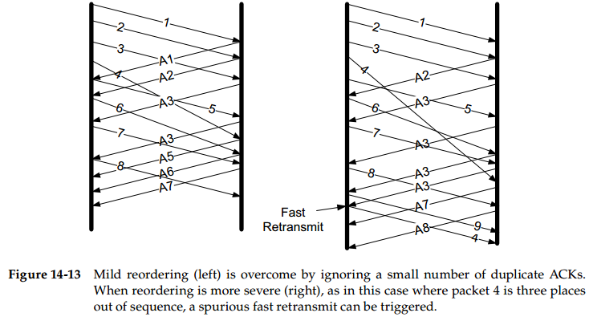

# Chapter 14. TCP Timeout and Retransmission

## Introduction

- 基于计时器的超时重传，相应的超时值就是**重传超时 RTO**
- 基于累积确认返回重复的`ACK`或是选择确认`SACK`的失序报文段的**快速重传 Fast Retransmit**

## Setting the Retransmission Timeout, RTO

RTT会随着时间而改变，TCP必须跟踪这些变化并及时调整RTO来保持较好的性能；通常在数据的**确认`ACK`中携带一个字节的数据来测量传输该`ACK`所需的时间**，测量结果称为RTT样本

**利用`TSOPT`测量RTT**参考CNP468，并且无论是报文段失序、丢失还是重传时，`TSOPT`都能较好工作

`TODO: 具体的RTO设置方法`

## Fast Retransmit

**基于接收端的反馈信息来引发必要的重传而非基于超时**，效率更高，更有效修复丢包问题

- 当失序数据到达时，接收方立即返回重复的`ACK`，因为假如丢包应能够立即引发重传
- 由于无法判断重复`ACK`是丢包还是一些包延迟到达，当**重复`ACK`到达时，超过一定数量才引发重传**而不必等到RTO超时

由于重复`ACK`只会导致重发这个`Seq`等于这个`ACK`的包，因此**每次快速重传只能填补一个丢包**

## Retransmission with Selective Acknowledgements

`ACK`号与接收端缓存中其他数据之间的间隔称为空缺，`Seq`高于空缺的数据为失序数据，由于`SACK`与`TSOPT`往往一起用，因此**一个`ACK`中通常可以包含3个`SACK`块，报告3个空缺**

- **数据接收端的`SACK`行为**
  每当缓存中存在失序数据时，接收端就可以生成`SACK`，由于`SACK`空间有限，因此应该尽可能包含最新数据，所以其包含的内容也依据接收的先后依次排列，放置最新的3个`SACK`块

  **若`SACK`/`ACK`丢失，且不是`SYN`/`FIN`分节，并且不携带应用层数据，则不会被重传**，因此3块`SACK`也有冗余备份的作用
- **数据发送端的`SACK`行为**
  最简单做法就是接收到`SACK`时直接重传`SACK`中表明的缺失部分

  注意：`SACK`是建议性的，极少可能在后续又要求重传，因此**发送方即使`SACK`确认接收也不能清除重传缓存，直到正式的`ACK`确认**

## Spurious Timeouts and Retransmissions

即使**没有丢包也引起的重传就是伪重传，其中主要原因是伪超时**，如下图中由于第5块的`ACK`未及时收到引发了超时重传，而实际上第5-8块都收到了却依然引起了重复发送5-8块，称为**go-back-N**

## Packet Reordering and Duplication

- **失序 Reordering**
  - 当失序发生在反向链路（`ACK`），使得TCP发送端窗口快速前移，接着又可能收到一些显然重复而应被丢弃的`ACK`
  - 当失序发生在正向链路（data），使得TCP接收方无法区分失序和丢失，因为两者都导致接收到无序的数据造成空缺
  
  
- **重复 Duplication**
  IP协议可能将单个包传输多次，较少出现这种情况，可能导致**伪快速重传**，利用`SACK`可以简单避免这种情况

  

## Repacketization

TCP重传时，并不需要重传完全相同的报文段，由于TCP是字节流协议，允许重新组包，**将多个字节连续的丢包合并成一个更大的报文段一次性重传**，但是大小不能超过`MSS`和`MTU`
