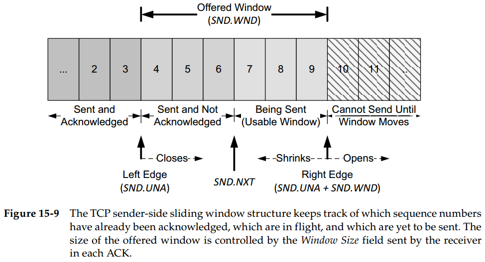
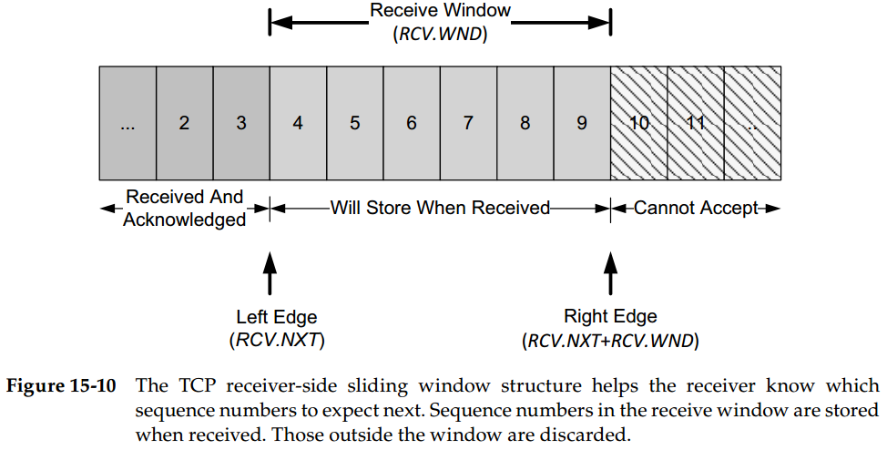

# Chapter 15. TCP Data Flow and Window Management

## Delayed Acknowledgments

TCP可以不对每个到来的数据包都进行`ACK`确认（**累积确认允许了延迟ACK**），采用延时`ACK`会减少`ACK`传输数量，减轻网络负载，但同时**延时不能过长，否则会导致伪重传**

## Nagle Algorithm

Nagle算法要求，当一个TCP连接中有在传数据（已发送但还未收到`ACK`的数据），则**小的报文段（长度小于`SMSS`）在收到所有在传数据的`ACK`前就不能发送**，并且这些小报文段需要被收集**整合成大报文段再发送**

- **延时`ACK`与Nagle算法结合**
  由于延时`ACK`要求收到多个数据包后再返回`ACK`，而Nagle算法则要求收到所有`ACK`后再发送新的整合报文段，导致两者相互矛盾，产生一个**短暂的死锁**
- **禁用Nagle算法**
  Nagle算法本质上就是**加大延迟但是提升流量**，因此对延迟敏感的程序应该禁用Nagle算法

## Flow Control and Window Management

TCP头部中由`Window Size`和`WSOPT`来通告窗口大小，若应用程序取数据速度慢，则可用空间减小，TCP就会通过**减小窗口大小来逐步限制接收数据**，进而发送方也会逐步减少发送数据，进而发送方的应用层也会无法将数据写入缓冲，即逐级**背压 back pressure**

- **滑动窗口**
  TCP连接的每一端都以字节为单位维护一个**发送窗口**结构和**接收窗口**结构 window structure
  - **TCP发送端滑动窗口**
    提供窗口 Offered Window 由数据接收端返回的ACK中的窗口大小 Window Size，因此能够立即发送的数据就是提供窗口-未确认数据大小的值（即`Available = SND.UNA + SND.WND - SND.NXT`），随着数据确认ACK以及提供窗口变大，整个流程不断滑动右移
    
  - **TCP接收端滑动窗口**
    到达数据包的`Seq`小于左边界就是重复数据被丢弃，大于右边界就是超出处理范围也会丢弃

    **对于累积`ACK`而言**，只有到达`Seq`等于左边界时数据才不会被丢弃，并且窗口滑动向右

    **对于选择确认`SACK`而言**，只要`Seq`在接收窗口内都不会被丢弃，但只有`Seq`等于左边界数据时窗口才滑动向右
    
- **零窗口于TCP持续计时器**
  当窗口值为0时就会阻止发送端继续发送数据，此时**接收端在重新获得可用空间时就会发送一个窗口更新报文段**来通知继续发送数据，由于这样的窗口更新往往是纯`ACK`，因此需要通过计时器**超时机制来确保收到窗口更新**，否则发送方没有收到窗口更新就会一直等待而不发送数据

  **发送端会采用TCP持续计时器，间歇性的查询**（发送窗口探测包，携带1个字节的数据）接收端看其窗口是否增长，并强制要求接收端返回`ACK`，不必发送整个窗口的数据，探测只需要1个字节的数据，接收端收到探测时，如果依然不可接收，则返回的`ACK`依然只要发送这个字探测包1字节前的`lastACK`即可
- **Silly Window Syndrome, SWS**
  由于接收端通告的窗口较小或发送的数据较小，最后导致出现TCP交换数据始终是较小的数据段，**大量小数据包使得网络资源消耗更多**，传输效率低
  - **对接收端，不通告较小的窗口值**，即在窗口值可增长到一个足够大（例如MSS）的大小之前，不通告比当前窗口更大的窗口值（例如一直通告0窗口避免小数据段，直到有足够大的空间直接通告大窗口）
  - **对发送端，不发送较小的报文段**，使用Nagle算法
- **大容量缓存与自动调优**
  由于现在的网络带宽极大，使用较小的TCP缓存将显著限制吞吐量和网络利用率，因此很多系统允许对缓存自动调优，使得一个较大的窗口成为可能，并且通过配合拥塞控制达到自动最优，即不浪费系统资源也充分利用网络资源

## Urgent Mechanism

不再推荐使用紧急机制 URG
