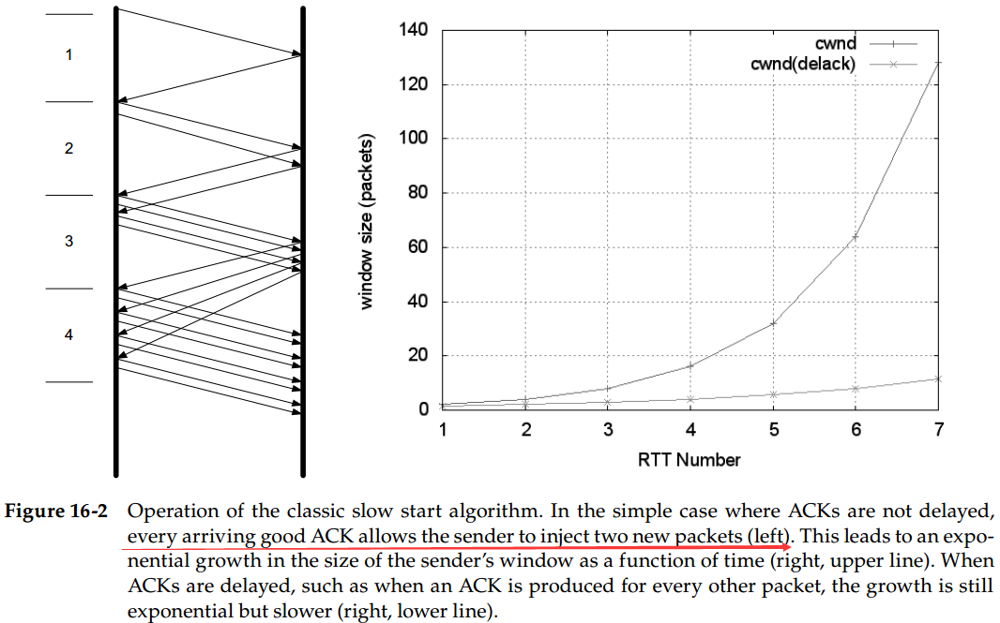
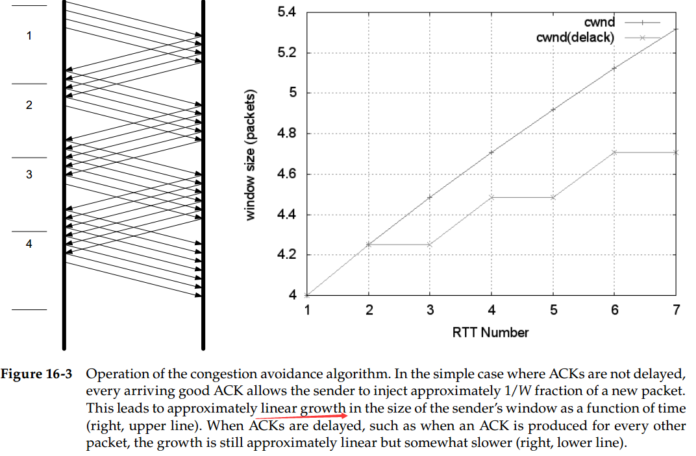
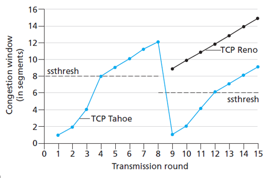

# Chapter 16. TCP Congestion Control

## The Classic Algorithm

稳定状态下的TCP拥塞控制行为，实际是试图使在网络传输路径上的数据报守恒

### 1. 慢启动 Slow Start

- 当一个新TCP**连接刚建立**，或是检测到丢包引起**重传超时**时，执行慢启动
- 设置一个初始窗口值 Initial Window，以这个值开始发送数据，并且每次收到好的ACK（即**ACK号大于此前收到的ACK**），就可以窗口值加倍发送数据，**指数级增长**

### 2. 拥塞避免 Congestion Avoidance

- 在慢启动的基础上，成倍增加会使得当前发送数据cwnd达到目前网络的一个**慢启动阈值ssthresh**（**指数增长**）
- 达到ssthresh后，TCP进入拥塞避免阶段，**每次的增长值近似于成功传输的数据段大小**，此时发送数据的增量就小了许多（**线性增长**）

### 3. 在慢启动和拥塞避免之间选择

- 当`cwnd < ssthresh`时启用慢启动，当`cwnd > ssthresh`时启用拥塞避免
- ssthresh根据每次出现重传时（此时TCP认为网络负载达到上限）的当前窗口大小来设定，往往是`ssthresh = max(cwnd/2, 2*SMSS)`

### 4. Tahoe, Reno和快速恢复 Fast Recovery

- **Tahoe算法**认为无论是重复`ACK`还是超时，都设置新的ssthresh后应该重新进入慢启动开始
- **Reno算法**认为如果是重复`ACK`引起的快速重传，不应该重新慢启动，而是在之前的ssthresh基础上快速恢复
- **Fast Recovery算法**认为，每收到一个`ACK`，cwnd就增长一个SMSS

## Evolution of the Standard Algorithms

`TODO: `
